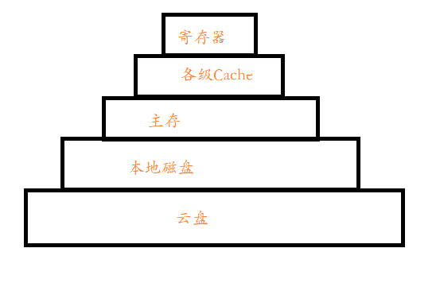


网速已不是桎梏，那桎梏在哪里？


<!-- more -->

---


***文章暂未完成！！！***


## 前言

5G会带来哪些技术发展？这个问题在看到华为1月13日深圳首测5G新闻时便在思考。昨天和别人交流时也不经意间挑起了这个话题，想借此机会写一写。当然这仅代表个人看法，很有可能有些观点是不对的，也欢迎大家在评论区共同探讨。

## 5G有什么新特性

我们知道3G、4G，那5G就是下一代（next generation）移动通信技术了。

可能会对某些名词很陌生，我也只是看过一些新闻报道和大佬们的评论。不过一些比较值得我们关心的特性还是比较清楚的。

1月14日央视新闻公众号发表了一篇文章[《比Wi-Fi快60多倍，比高清清晰4倍！5G+4K，是时候“种草”了！》](https://mp.weixin.qq.com/s?__biz=MTI0MDU3NDYwMQ==&mid=2656731598&idx=1&sn=72bb734076a75781355e607bf92ee138&chksm=7a607c284d17f53e6d46151b3cc132984322bab60dcac85a367a3009fc6e0ca710ea29094273&mpshare=1&scene=23&srcid=01140Ws70oMmlIw3GZy71Xup#rd)。值得我们关注的就是网速和使用方式了。这也肯定是大家比较关心的问题。

### 速度有多快

5G理论速率峰值达10Gb/s，1.25GB/s，**50GB的游戏1分钟之内下完**。当然这只是理论上的峰值，一般是低于峰值的，需要考虑信号强弱和网络拥塞等情况。

相对应的，现在用的比较多的是如下几种媒介：

- 家用千兆带宽（并不常见），理论速率峰值1Gb/s，0.125GB/s，**50GB的游戏需下载近10分钟**。
- 主流手机连Wi-Fi理论速率峰值150Mb/s，18.75MB/s，**50G游戏下载近1小时**
- 家庭常用100M宽带，理论速率峰值100Mb/s，12.5MB/s，**50G游戏下载1-2小时**
- 4G网络，理论速率峰值同家用100M宽带

### 5G怎么使用

#### 缺点

- 由于物理波段的限制，也将会与其他通信技术并用，包含长距离的其他传统电信波段。（摘自[维基百科](https://zh.wikipedia.org/wiki/5G)）

## 带来的技术发展

### 云硬盘（实现真正的存储器层次结构最后一层）

这是我想到的第一条，而且应该是应用更为大众化的。而且不仅仅是云硬盘，与之相连的一系列云服务都会大量使用，因为网速不再是瓶颈，云服务和本地服务几乎没有差距，而且云服务计算更为迅速。

为什么是云硬盘呢？

谈到硬盘，这就想到了去年买iPad2018，32GB本地存储存存文档还可以，小电影能存得了几部？（兄嘚，评论区借一部说话？ :smile:）

最终说动我自己下定决心的就是想到了存储器层次结构（本地存储不够，那就百度云呗。按局部性原理需求换入换出）

这是我思考的存储器层次结构：

5G时代的到来，打破了网速的桎梏，这不就是实现了真正的**存储器层次结构**的最后一层吗？

### 智能便携式设备

> 可能某些硬件和非硬件技术还没达到要求

### 物联网（叶子节点设备蓝牙+ZigBee如何解决）

### VR、视频等

## 总结