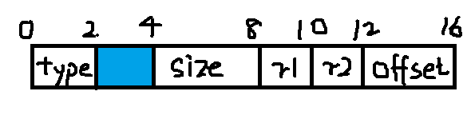


所见所观，皆为虚幻。


<!-- more -->

---

## 前言

[BMP文件处理（C语言实现）](bitmap-resolver.html)这篇文章中说到了两个不足之处：

- 文件头的字节对齐问题
- BMP文件的特殊宽度处理问题

对于字节对齐，可以查看[计算机的字节对齐](byte-alignment.html)这篇文章。本篇文章主要写对BMP文件的特殊宽度处理。


## 文件头的字节对齐问题


上次文章中写到的BMP文件头的结构体是下文中代码块这样的，结合字节对齐规则，**“K大小的基本数据类型的地址必须是K的倍数”，“对于结构体，结构体的地址是结构体内最大元素字节大小的整数倍，结构体的大小是结构体内最大元素字节大小的整数倍”。**


```c
typedef struct bitmapFileHeader {
	unsigned char type[2];
	unsigned size;
	unsigned char resvered1[2];
	unsigned char reserved2[2];
	unsigned offset;
} BMFILEHEADER;
```


但是，实际要求BMP文件头大小必须是14，而针对以上结构体进行`sizeof()`运算得到的数值是**16**。结果显然是错误的，错误原因如下所示：

1. 结构体大小必须是结构体内最大元素字节大小的整数倍（最大的是unsigned，4字节）（*所以肯定不是*14）。
2. 结构体的地址是结构体内最大元素字节大小的整数倍，在此假设一个结构体首地址是0

下图便是划分图：



对于char数组而言，并无特殊字节对齐要求，但是对于unsigned类型，需要首地址为4的倍数。因此在type字段后面的两个字节需要填充。

这样，结构体的大小为最大元素大小4的倍数，结构体的地址是最大元素字节的整数倍。所以结果总大小为16。


那么应该怎么写呢？需要14个字节的大小的BMP文件头。为了简单起见，我是这么写的：

```c
typedef struct bitmapFileHeader {
	unsigned char type[2];
	unsigned char size[4];
	unsigned char resvered1[2];
	unsigned char reserved2[2];
	unsigned char offset[4];
} BMFILEHEADER;
```


因为都是元素都是char类型的，所以不需要刻意的字节对齐。但是虽然简单了，数据访问是个问题。比如想访问offset这个应该为int类型的字段应该如何访问？在此感谢[XBlame](https://github.com/Blameying)的指导。写法是这样的：


```c
*(int *)offset;
```

首先将`char*`类型转换为`int*`，然后通过`*`来索引，得到的就是一个int值。

相对应的，你想获取size字段，就需要使用：

```c
*(int *)size;
```


## BMP文件的特殊宽度处理

[BMP文件处理（C语言实现）](bitmap-resolver.html)这篇文章中说到BMP的宽度字节数规定必须为4的倍数，文章中的代码读取BMP宽度字节数为非4倍数并且不为3的倍数时（是3倍但不是4倍时，不会造成像素偏移），会造成像素偏移问题，效果如下：

> 大图没有保留，只剩小的测试图了，不过效果就是有线条（RGB像素字节错位所致）


根据测试，BMP的宽度字节数不是4的倍数时，也有特别情况，这种情况下我的程序也能处理。为什么呢？

BMP的宽度字节规定必须为4的倍数，在宽度字节数不为4的倍数时，就需要补齐。这说明补齐字节数有可能是0、1、2、3这几个数中的一个（0的时候宽度字节数是4的倍数）。如果需要补齐的字节数为3，这就是特殊情况，每行补齐三个字节数，顺序读取并没有导致RGB的字节错位。相反的，如果补齐字节数为1或者2，这样每一行都会多于1个或者2个字节，顺序读取就会造成RGB字节错位，而且是周期性的（补齐字节为1或2，则3行显示一行正确像素），所以显示图片能够看出原来的样子，但是有线条。如果字节全部错乱就完全不像原图了。


那么解决方法是什么？

> 遇到补齐的字节跳过。


那么问题来了，如何知道每行补齐的字节数和实际？

获取信息头里面的sizeImage字段（指的是图像实际用到的字节数，包含补齐），用它除以高度得到的是每行的字节数realWidth（包含补齐字节）。用realWidth整除每个像素所含字节数3，得到实际像素数；realWidth对3取余，得到补齐字节数。

在读取的时候每行只需要跳过最终的补齐字节，输出时输出补齐字节即可。

代码如下：

```c
unsigned offset = *(int *)(header.offset);
unsigned realWidth = info.sizeImage / info.height;
unsigned rowPixelNumber = realWidth / sizeof(RGBITEM);
unsigned remanentByteOfRow = realWidth % sizeof(RGBITEM);
unsigned pixelCounts = rowPixelNumber * info.height;
fseek(fp, offset, 0);


RGBITEM *pitem = (RGBITEM *)malloc(pixelCounts*sizeof(RGBITEM));
//char *garbage = (char *)malloc(remanentByteOfRow);

for (size_t i = 0; i < info.height; i++)
{
    RGBITEM * currentAddr = pitem + i * rowPixelNumber;
    fread(currentAddr, sizeof(RGBITEM), rowPixelNumber, fp);
    //fread(garbage, remanentByteOfRow, 1, fp);
    fseek(fp, remanentByteOfRow, SEEK_CUR);
}
```


## 转为8位灰度图


在上篇文章中展示的灰度图是用24位真彩色位图模拟的，就是将RGB三个字节都设为通过RGB求得的一个灰度值，这样无疑就每3个字节浪费2个字节，结果是输出的位图8位灰度图大小比24模拟灰度图会小$\frac{2}{3}$。

那么将24位真彩色（RGB）位图转换为8位灰度图需要修改那些属性呢？

### 方法

1. 图像数据$RGB24位真彩色\to8位灰度$
2. 调色板数据添加，每个单位1个字节
3. 文件头
   1. 文件大小
   2. 偏移量
4. 信息头
   2. 颜色位数
   3. 图像实际所用字节数


### 实现


```c
void BMP24To8Gray(const char * from, const char * to) {
	BMFILEHEADER fromHeader;
	INFOHEADER fromInfo;


	RGBITEM ** fromData = malloc(sizeof(RGBITEM*));
	RGBQUAD ** fromPalette = malloc(sizeof(RGBQUAD*));

	int fromPixelNumber = BMPReader(from, &fromHeader, &fromInfo, fromPalette, fromData);


	BMFILEHEADER toHeader = fromHeader;
	INFOHEADER toInfo = fromInfo;
	// set info
	toInfo.colorCount = 8;
	toInfo.infoHeaderSize = 40;
	toInfo.planes = 1;
	toInfo.sizeImage = (toInfo.width+3)/4*4*toInfo.height;
	toInfo.colorUsed = 256;


	RGBQUAD ** toPalette = malloc(sizeof(RGBQUAD*));
	*toPalette = malloc(256 * sizeof(RGBQUAD));
	for (size_t i = 0; i < 256; i++)
	{
		((*toPalette) + i)->r = ((*toPalette) + i)->b = ((*toPalette) + i)->g = i;
	}

	unsigned char **toData = malloc(sizeof(unsigned char *));
	*toData = malloc(fromPixelNumber);

	for (size_t i = 0; i < fromPixelNumber; i++)
	{
		*(*toData+i)= ((*fromData + i)->r * 299 + (*fromData + i)->g * 587 + (*fromData + i)->b * 114 + 500) / 1000;
	}

	*(unsigned *)toHeader.offset = sizeof(toHeader) + sizeof(toInfo) + 256 * sizeof(RGBQUAD);
	*(unsigned *)toHeader.size = toHeader.offset + toInfo.sizeImage;

	BMPWriter8(to, &toHeader, &toInfo, toPalette, toData);

}
```


## 代码




**全部代码请查看[GitHub](https://github.com/ScarboroughCoral/DIPModule**




```c
#include "BMP.h"
#include<stdlib.h>
#include<stdio.h>

#pragma warning(disable : 4996)

void BMPResolver() {
	FILE * fp = fopen("width.bmp", "rb");
	if (fp == NULL)
	{
		getchar();
		return;
	}
	BMFILEHEADER header;
	INFOHEADER info;
	
	fread(&header, 14, 1, fp);
	fread(&info, sizeof(INFOHEADER), 1, fp);


	//RGBQUAD * prgbquad = (RGBQUAD *)malloc(info.colorUsed * sizeof(RGBQUAD));
	//fread(prgbquad, sizeof(RGBQUAD), info.colorUsed, fp);
	unsigned offset = *(int *)(header.offset);
	unsigned realWidth = info.sizeImage / info.height;
	unsigned rowPixelNumber = realWidth / sizeof(RGBITEM);
	unsigned remanentByteOfRow = realWidth % sizeof(RGBITEM);
	unsigned pixelCounts = rowPixelNumber * info.height;
	fseek(fp, offset, 0);


	RGBITEM *pitem = (RGBITEM *)malloc(pixelCounts*sizeof(RGBITEM));
	char *garbage = (char *)malloc(remanentByteOfRow);

	for (size_t i = 0; i < info.height; i++)
	{
		RGBITEM * currentAddr = pitem + i * rowPixelNumber;
		fread(currentAddr, sizeof(RGBITEM), rowPixelNumber, fp);
		fread(garbage, remanentByteOfRow, 1, fp);
		//fseek(fp, remanentByteOfRow, SEEK_CUR);
	}


	//修改单色
	//for (size_t i = 0; i < pixelCounts; i++)
	//{
	//	//printf("%p-%p\n", pitem,pitem+1);
	//	//(pitem+i)->r = 0;
	//	(pitem + i)->g = 0;
	//	(pitem + i)->b = 0;
	//}

	//灰度化
	int gray;
	/*for (size_t i = 0; i < pixelCounts; i++)
	{
		gray = ((pitem + i)->r * 299 + (pitem + i)->g * 587 + (pitem + i)->b * 114 + 500) / 1000;
		(pitem + i)->r = gray;
		(pitem + i)->g = gray;
		(pitem + i)->b = gray;
	}*/

	//灰度图反色
	for (size_t i = 0; i < pixelCounts; i++)
	{
		gray = ((pitem + i)->r * 299 + (pitem + i)->g * 587 + (pitem + i)->b * 114 + 500) / 1000;
		(pitem + i)->r = 255 - gray;
		(pitem + i)->g = 255 - gray;
		(pitem + i)->b = 255 - gray;
	}

	char * result = "result.bmp";
	FILE * rp = fopen(result, "wb");
	if (rp == NULL)
	{
		return;
	}
	fwrite(&header, 14, 1, rp);
	fwrite(&info, sizeof(INFOHEADER), 1, rp);
	fseek(rp, offset, 0);
	//fwrite(prgbquad, sizeof(RGBQUAD), info.colorUsed, rp);
	//fwrite(pitem, sizeof(RGBITEM), info.sizeImage / 3, rp)

	for (size_t i = 0; i < info.height; i++)
	{
		fwrite(pitem+i*rowPixelNumber, sizeof(RGBITEM), rowPixelNumber, rp);
		fwrite(garbage, remanentByteOfRow, 1, rp);
	};
	printf("Output singleColor.bmp  successfully!\n");
	fclose(fp);
	fclose(rp);
}
```


## 总结


