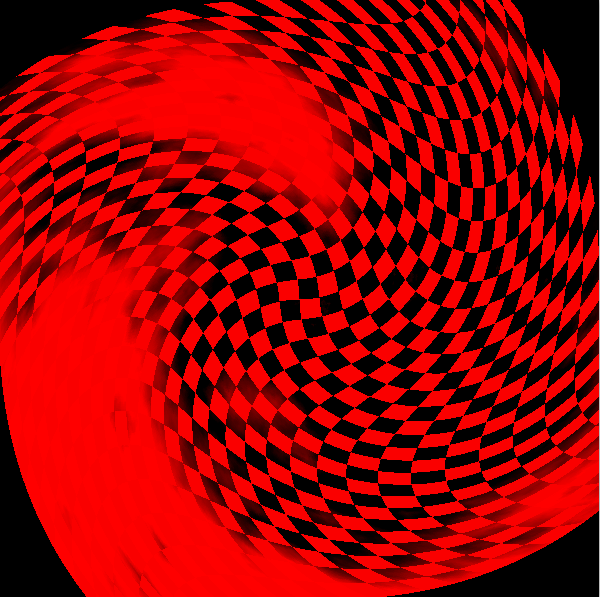
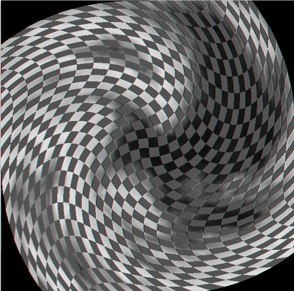


模拟信号到数字信号是一个神奇的过程。


<!-- more -->

---


## 前言

本系列文章（DIP，Digital Image Processing），用于记录总结数字图像处理课程的实验内容。目录请参考[DIP系列文章](/tags/DIP/)


## 题目要求

1. 24位图像对R,G,B三个分量进行分离，产生3幅新的图像
2. 24位彩色图像灰度化
3. 对8位灰度图进行反色


## 原图（测试图像）

找了一个便于观察的图像：


## 思路与步骤

整体思路如下：

1. 读取图像文件属性与图形数据内容
2. 图像文件属性与图形数据处理
   1. 对R,G,B三个分量进行分离，需要将无关分量置0
   2. 灰度化需要利用RGB转灰度公式进行转换
   3. 对灰度图进行255求补运算
3. 将处理后的数据输出到目标图像文件


## BMP图像文件格式

BMP图像文件由四部分构成：
1. 位图文件头
2. 位图信息头
3. 调色板
4. 实际位图数据

以下是各部分的详细属性：

### 位图文件头

|     属性含义（按读取顺序描述）     | 所占空间大小（单位字节，byte） |
| :--------------------------------: | :----------------------------: |
|        文件类型，必须是“BM”        |               2                |
|     文件大小，包含文件头的大小     |               4                |
|               保留字               |               2                |
|               保留字               |               2                |
| 从文件头到实际位图数据的偏移字节数 |               4                |


### 位图信息头

|                  属性含义（按读取顺序描述）                  | 所占空间大小（单位字节，byte） |
| :----------------------------------------------------------: | :----------------------------: |
|                      该结构的长度，为40                      |               4                |
|                           图像宽度                           |               4                |
|                           图像高度                           |               4                |
|                      位平面数，必须为1                       |               2                |
|       颜色位数：1为二值，4为16色，8为256色，24为真彩色       |               2                |
| 是否压缩：指定位图是否压缩，有效的值为BI_RGB，BI_RLE8，BI_RLE4，BI_BITFIELDS(都是一些Windows定义好的常量)。要说明的是，Windows位图可以采用RLE4，和RLE8的压缩格式，但用的不多。我们今后所讨论的只有第一种不压缩的情况，即biCompression为BI_RGB的情况。 |               4                |
| 实际位图数据占用的字节数：【实际位图数据占用的字节数】=【图像宽度】’ × 【图像高度】。上述公式中的【图像宽度】’必须是4的整倍数(所以不是【图像宽度】，而是【图像宽度】’，表示大于或等于【图像宽度】的，最接近4的整倍数。举个例子，如果【图像宽度】=240，则【图像宽度】’=240；如果【图像宽度】=241，【图像宽度】’=244)。 |               4                |
|                      目标设备水平分辨率                      |               4                |
|                      目标设备垂直分辨率                      |               4                |
| 实际使用的颜色数：如果该值为零，则用到的颜色数为2的【颜色位数】次方种。 |               4                |
|                      图像中重要的颜色数                      |               4                |


### 调色板

可选项，只在需要调色板的情况下出现。

调色板实际上是一个数组， 共有【实际使用的颜色数】个元素。数组中每个元素的类型是一个如下的结构，每个占4个字节，其定义如下：

| 属性含义（按读取顺序描述） | 所占空间大小（单位字节，byte） |
| :------------------------: | :----------------------------: |
|      该颜色的蓝色分量      |               1                |
|      该颜色的绿色分量      |               1                |
|      该颜色的红色分量      |               1                |
|           保留值           |               1                |


### 实际位图数据

共有位图信息头中所示属性中的【实际位图数据占用的字节数】个字节，每3个字节构成一组RGB真彩色像素，所以共有$【实际位图数据占用的字节数/3】$个字节。


## 详细实现思路

### RGB分离

- 实现

只需要将每个RGB像素中的不同分量置0即可，如下代码就是得到分离R分量的方法，最终输出图片只有红色分量：

```c
for (size_t i = 0; i < itemCounts; i++)//itemCounts：像素总数
{
	(pitem + i)->g = 0;//pitem：某个像素
	(pitem + i)->b = 0;
}
```

- 结果




### RGB转灰色图

- 实现

采用如下公式转换：
$$
Gray = R\times0.299 + G\times0.587 + B\times0.114
$$
如下代码实现：

```c
for (size_t i = 0; i < itemCounts; i++)
{
	gray = ((pitem + i)->r * 299 + (pitem + i)->g * 587 + (pitem + i)->b * 114 + 500) / 1000;
	(pitem + i)->r = gray;
	(pitem + i)->g = gray;
	(pitem + i)->b = gray;
}
```


- 结果




### 灰度图反色

- 实现

将灰度对255求补即可，如下代码：

```c
for (size_t i = 0; i < itemCounts; i++)
{
	gray = ((pitem + i)->r * 299 + (pitem + i)->g * 587 + (pitem + i)->b * 114 + 500) / 1000;
	(pitem + i)->r = 255-gray;
	(pitem + i)->g = 255-gray;
	(pitem + i)->b = 255-gray;
}
```

- 结果


## 代码




**全部代码请查看[GitHub](https://github.com/ScarboroughCoral/DIPModule**






### 纠正

本程序是不完全版本，或者说是错误版本。有以下两点不足：

- 未对图像宽度非4倍数进行特殊处理。
- 本文只对灰度图只做了24位模拟，没有转化为8位灰度图。
- 文件头的字节对齐问题，相关文章[计算机的字节对齐](byte-alignment.html)

修正版本请查看[BMP文件的特殊宽度处理及字节对齐问题](bitmap-resolver-rectify.html)



所有代码如下：



### Main.c



```c
//Main.c

#include <stdio.h>
#include <stdlib.h>
#include "BMP.h"
//#include <Windows.h>
#pragma warning(disable : 4996)


int main(){

	FILE * fp = fopen("test.bmp","rb");
	if (fp==NULL)
	{
		getchar();
		return;
	}
	BMFILEHEADER header;
	INFOHEADER info;
	fread(&header, sizeof(header),1,fp);
	fread(&info, sizeof(info), 1, fp);
	RGBQUAD * prgbquad = (RGBQUAD *)malloc(info.colorUsed*sizeof(RGBQUAD));
	fread(prgbquad, sizeof(RGBQUAD), info.colorUsed, fp);
	//fseek(fp, header.offset, 0);
	RGBITEM *pitem = (RGBITEM *)malloc(info.sizeImage);
	
	unsigned itemCounts = info.sizeImage / (unsigned)3;
	fread(pitem, sizeof(RGBITEM), itemCounts, fp);


	//修改单色
	//for (size_t i = 0; i < itemCounts; i++)
	//{
	//	//printf("%d\n", pitem->r);
	//	(pitem+i)->r = 0;
	//	//(pitem+i)->g = 0;
	//	(pitem + i)->b = 0;
	//}

	//灰度化
	int gray;
	for (size_t i = 0; i < itemCounts; i++)
	{
		gray = ((pitem + i)->r * 299 + (pitem + i)->g * 587 + (pitem + i)->b * 114 + 500) / 1000;
		(pitem + i)->r = gray;
		(pitem + i)->g = gray;
		(pitem + i)->b = gray;
	}
	
	//灰度图反色
	/*for (size_t i = 0; i < itemCounts; i++)
	{
		gray = ((pitem + i)->r * 299 + (pitem + i)->g * 587 + (pitem + i)->b * 114 + 500) / 1000;
		(pitem + i)->r = 255-gray;
		(pitem + i)->g = 255-gray;
		(pitem + i)->b = 255-gray;
	}*/

	char * result = "singleColor.bmp";
	FILE * rp = fopen(result, "wb");
	if (rp==NULL)
	{
		return;
	}
	fwrite(&header, sizeof(header), 1, rp);
	fwrite(&info, sizeof(info), 1, rp);
	//fseek(rp, header.offset, 0);
	fwrite(prgbquad, sizeof(RGBQUAD), info.colorUsed, rp);
	fwrite(pitem, sizeof(RGBITEM), info.sizeImage / 3, rp);
	printf("Output singleColor.bmp  successfully!\n");
	system("pause");
	return 0;
}
```




### BMP.h



```c
//BMP.h

#pragma once


typedef struct bitmapFileHeader {
	unsigned char type[2];
	unsigned size;
	unsigned char resvered1[2];
	unsigned char reserved2[2];
	unsigned offset;
} BMFILEHEADER;

typedef struct rgb {
	unsigned char r;
	unsigned char b;
	unsigned char g;
}RGBITEM;


typedef struct bitMapInfoHeader {
	unsigned infoHeaderSize;
	unsigned long width;
	unsigned long height;
	unsigned short planes;
	unsigned short colorCount;
	unsigned isCompressed;
	unsigned sizeImage;
	unsigned long xPelsPerMeter;
	unsigned long yPelsPerMeter;
	unsigned colorUsed;
	unsigned colorImportant;
}INFOHEADER;

typedef struct RGBQUAD {
	unsigned char b;
	unsigned char g;
	unsigned char r;
	unsigned char reserved;

}RGBQUAD ;
```


## 总结

代码简单，关键在于知识点的掌握。请继续关注[DIP，数字图像处理系列文章](/tags/DIP/)！