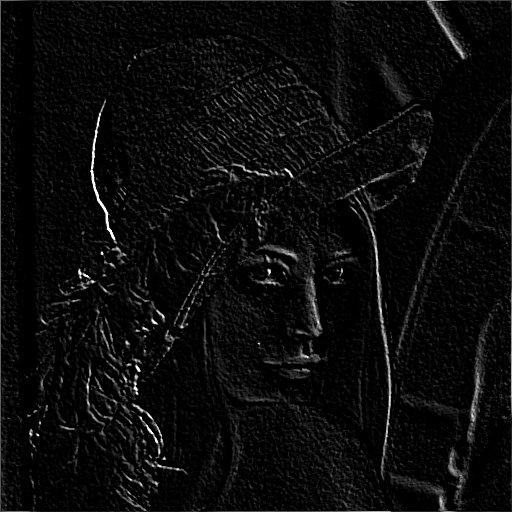
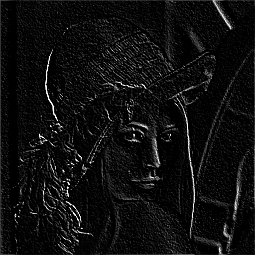
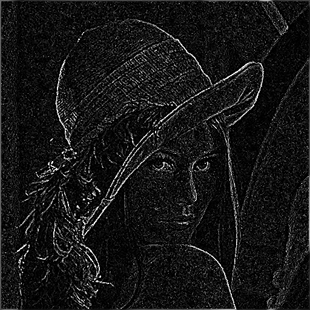


变化的变化率，用于描述变化的变化速度和方向。


<!-- more -->

---

## Forword

很长时间不写博客了，图像处理实验开始整体验收了，这两天爆肝，在做实验的同时认真写博客总结。确实感觉这门课学得不好（实际上感觉大学所有的课都学的不好，逃……），主要是因为数学知识不够牢固，而且一般的数学证明思维也忘得差不多了。

本系列文章（DIP，Digital Image Processing），用于记录总结数字图像处理课程的实验内容。目录请参考[DIP系列文章](/tags/DIP/)。



**本次不展示代码，全部代码请查看[GitHub](https://github.com/ScarboroughCoral/DIPModule)**



## 实验内容

这次实验内容是边缘检测，一开始的时候做了一部分了，是针对`prewitt`算子和`sobel`算子的，剩下`log`和`canny`方法还没做，canny选做。

- 使用Prewitt算子实现边缘检测
- 使用Sobel算子实现边缘检测
- 使用LOG算子实现边缘检测

## 实验过程

> 用于检测图像中一些物体边缘的地方。比如无人机、自动驾驶障碍物检测等会使用到。

主要方法有以下几种：

### Prewitt

> 引入了平均因素，对噪声有抑制作用；操作简便。

- 垂直边缘检测算子

$$
     \begin{bmatrix}
       -1&0&1\\\\
       -1&0&1\\\\
       -1&0&1 
     \end{bmatrix}
$$

- 水平边缘检测算子

$$
       \begin{bmatrix}
         -1&-1&-1\\\\
         0&0&0\\\\
         1&1&1 
       \end{bmatrix}
$$

### Sobel

> 引入了平均因素，增强了最近像素的影像，噪声抑制效果比Prewitt好。

- 垂直边缘检测算子

$$
        \begin{bmatrix}
         -1&0&1\\\\
         -2&0&2\\\\
         -1&0&1 
       \end{bmatrix}
$$

- 水平边缘检测算子

$$
        \begin{bmatrix}
         -1&-2&-1\\\\
         0&0&0\\\\
         1&2&1 
       \end{bmatrix}
$$

### LOG

> 该算子首先用高斯函数对图像作平滑滤波处理，然后才使用Laplacian算子检测边缘，因此克服了Laplacian算子抗噪声能力比较差的缺点，但是在抑制噪声的同时也可能将原有的比较尖锐的边缘也平滑掉了，造成这些尖锐边缘无法检被测到。

$$
\begin{bmatrix}
    0&0&-1&0&0\\\\
    0&-1&-2&-1&0\\\\
    -1&-2&16&-2&-1\\\\
    0&-1&-2&-1&0\\\\
    0&0&-1&0&0
\end{bmatrix}
$$

## 实验结果

- 原图

- Prewitt横纵叠加

- Sobel纵横叠加

- Log算子

