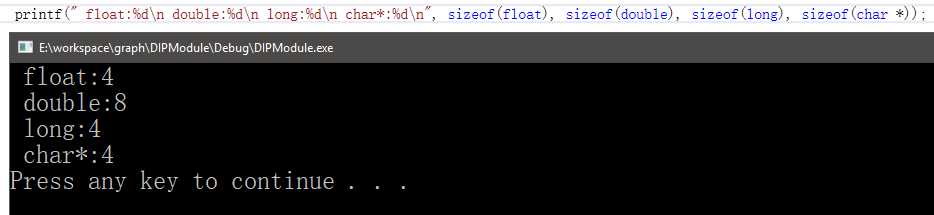
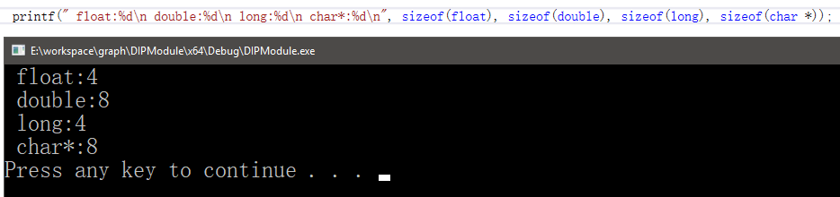
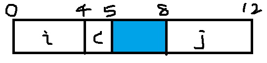
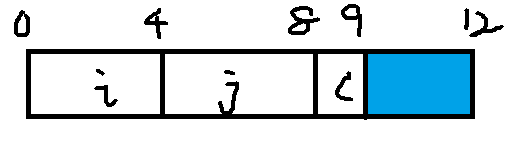



凡事皆有因，刨根问底，追求极致。



<!-- more -->

---


## 前言

在[BMP文件处理（C语言实现）](bitmap-resolver.html)一文中说到文件头的自定义结构体会引起“字节对齐效应”，进而造成文件读取属性错位，严重造成读取错误。这篇文章主要回顾总结一下字节对齐问题。内容总结自《深入理解计算机系统》。

## 什么是字节对齐

许多计算机系统对基本数据类型的合法地址做了一些限制，要求某种类型对象的地址必须是某个值K（通常是2，4，8）的倍数。


***无论是否对齐，x86-64硬件都能正常工作。不过Intel还是建议要对齐数据以提高内存系统的性能。***


## 字节对齐有什么好处

字节对齐有一些隐含的好处：

- 简化形成处理器和内存系统之间的硬件设计。
- 提高内存系统的效率
  - 例如一个处理器总是从内存中读取8个字节，那么地址必须为8的倍数。比如说double类型，如果地址为8的倍数只需要读取1次就能获得，否则可能需要执行两次内存访问，因为数据放到了两个8字节内存块中。


## 字节对齐原则


***任何K字节大小的基本对象的地址必须是K的倍数。，“对于结构体，结构体的地址是结构体内最大元素大小的整数倍，结构体的大小是结构体内最大元素字节大小的整数倍”。***


### 一些基础数据类型的对齐方式

一些常见的基本类型根据字节对齐原则获得的对齐地址方式如下：

|  K   |       类型        |
| :--: | :---------------: |
|  1   |       char        |
|  2   |       short       |
|  4   |     int,float     |
|  8   | long,double,char* |

> 注意：这些类型都是在x86-64位某些特定机下的64位模式运行时对齐方式。


确保每种数据类型都是按照指定方式来组织和分配，即每种类型的对象都满足它的对齐限制，就可保证实施对齐。


比如我的电脑是x86-64位机，但是针对VS有x86和x64两种模式。这有不同的结果：


1. **x86**

   

2. **x64**





于是类型所占字节大小不同，所以K值不同。不管类型大小为多少个字节，只要根据字节对齐原则就可以了。



## 一些例子


### 汇编命令

编译器在汇编代码中放入命令，指明全局数据所需的对齐。

```assembly
.align 8
```

> 该命令保证了它后面的变量的起始地址是8的倍数。


### 结构体的字节对齐

1. eg-1

编译器会对包含结构体的代码内部需要的字段插入间隙，以满足对其要求。

```c
struct S1 {
    int i;
    char c;
    int j;
};
```

int和char的大小分别是4个字节、1个字节。假设编译器用最小的9字节分配，画出来是这样的：


> 这样int变量i和j是无法同时满足对齐原则的。


取而代之，编译器在字段c和j之间插入一个3字节的间隙（蓝色部分）。




此外，编译器必须保证任何 `Struct S1 *` 类型的指针p都满足4字节对齐。这样保证了首元素（变量i）是4字节对齐，而且内部变量也都是4字节对齐了。



2. eg-2

对于结构体数组，编译器可能会在结构体末尾进行填充来满足其对齐要求。


```c
struct S2{
    int i;
    int j;
    char c;
};
```

如果用最小的9字节分配，很明显只要保证结构体初始地址是4字节倍数就可满足对齐要求。

但是针对结构数组，有连续的元素，9字节分配就无法保证字节对齐要求了，如下声明：

```c
struct S2 d[4];
```


这就需要编译器对结构体末尾进行填充。当然最后3个字节是浪费的空间。如下图：




## 强制对齐

如果数据没有对齐，某些型号的Intel和AMD处理器对于有些实现多媒体操作的SSE指令，就无法正确执行。


任何针对x68-64处理器的编译器和运行时系统都必须保证分配用来保存可能会被SSE寄存器读或写的数据结构的内存，都必须满足16字节对齐。


这个要求的后果：

1. 任何内存分配函数（alloca、malloc、calloc或realloc）生成的块的起始地址都必须是16的倍数。
2. 大多数函数栈帧的边界都必须是16的倍数。


不过较近版本的x86-64处理器实现了AVX多媒体指令。除了提供SSE指令的超集，支持AVX的指令并没有强制性的对齐要求。

## 如何避免字节对齐引发的问题

另谈！待续……

## 总结

面向位级的理解是很有必要的，比如这次BMP文件的读写，读写文件头自定义数据结构而没有用Windows.h里的宏定义，这引发的问题就是对字节对齐这个概念还不够敏感。所以基础不牢，地动山摇；原理不解，实践何解？