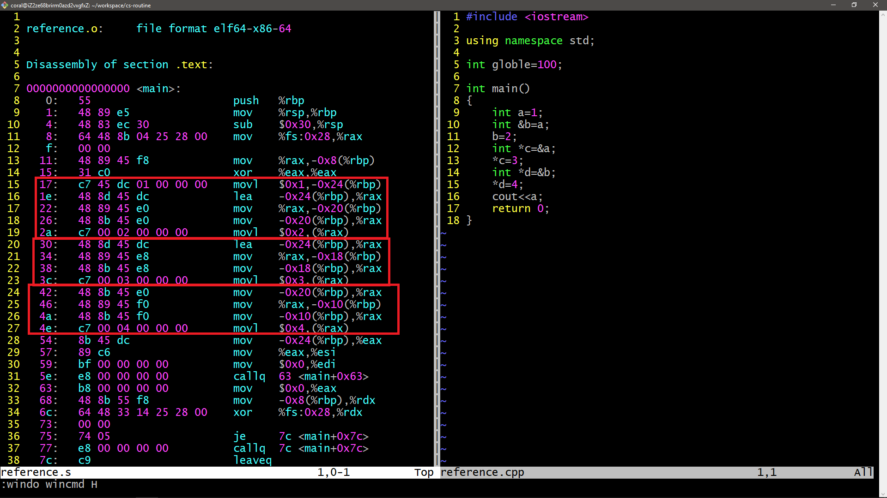
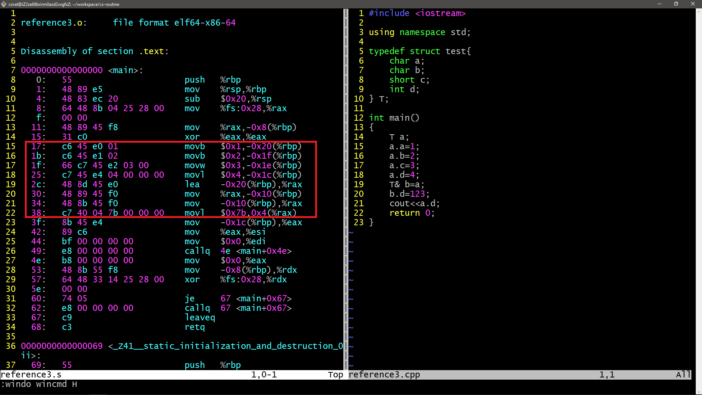
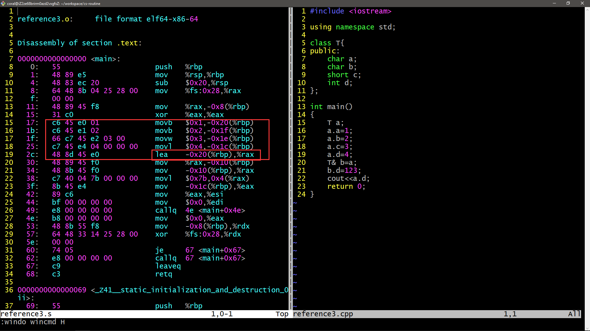
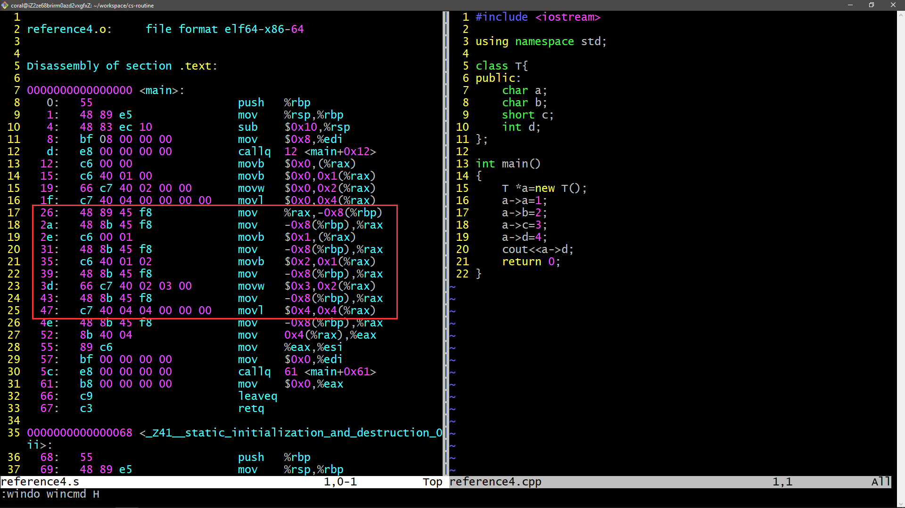



"Reference & Pointer in C" expressed in English.



<!-- more -->

---

## Forword

The reason why I write this blog article is just to understand the reference and pointer completely.Let's have a look the underlying implementation of the reference and pointer.

## Music
> ***天净沙*** By **骆集益/周志华**

<iframe frameborder="no" marginwidth="0" marginheight="0" width=330 height=86 src="//music.163.com/outchain/player?type=2&id=26344079&auto=1&height=66"></iframe>

## In one word



Reference is the same as pointer in essence.Both are the address,and the differences between both are the using rules.



## Body

There are some situations:

- Basic data type reference
- Struct type reference
- Class type reference
- Class type pointer
- About the segment

We will talk it in the above way.

### 0x01 Basic data type reference

There are two programs in this situation.

- Let's see the reference and pointer in underlying assembly code :-)

In this program,we can conclude these results:

1. The local variables is saved in the address begining with `%rbp-0x24`(to increasing direction.).The `int` type variables cover 4 bytes and the `address` type variables cover 8 bytes.
   1. Variable `a` is saved at `%rbp-0x24`
   2. Variable `b` is saved at `%rbp-0x20`
   3. Variable `c` is saved at `%rbp-0x18`
   4. Variable `d` is saved at `%rbp-0x10` 

2. **The reference and the pointer both are address.**

- Let's see the instance of reference in calling functions.

We can conclude these results:

1. Call-by-reference relays the parameters by their address.
2. We have known that we can call by value.Of course,the address is also a value.Thus,we can think that there is only call-by-value.

### 0x02 Struct type reference

Let's talk about reference in struct type variables.

In this program,we can conclude that:

1. The variables defined in the way - `T a;` - are all saved in the stack frame.
2. The reference of struct-type variables is also an address.

### 0x03 Class type reference

The class-type instance is the same as the struct.

It's easy! You can jump it!

### 0x04 Class type pointer

Let's have a look at the instance defined by `new`:

We can conclude that the pointer is just the address points to the heap somewhere.Of course,the address in the heap is undefined,because it's dynamic and the assembly code is `objdump` by `gcc -c(Compile and assemble, but do not link)`

### 0x05 About the segment
In the situation,I want to have a look at the global variables,but I don't find it in the assembly code.It's in the **data segment**!

Let's retrospect the segment partition:

## Conclusion

In the article,we explore the underlying assembly code of reference and pointer,and we review the segment partition.Hope you can get a lot.

Have a nice day.
Bye!
-:)

