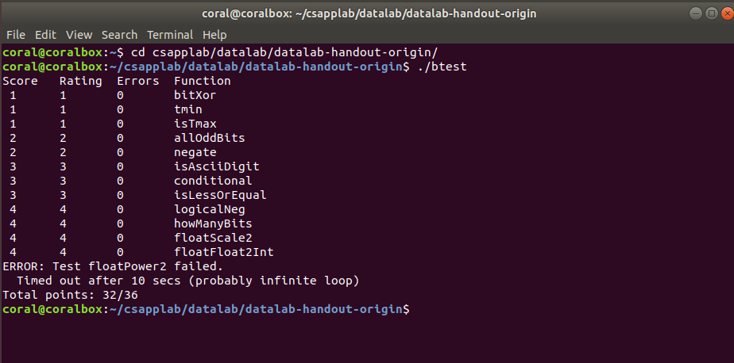



纸上得来终觉浅，绝知此事要躬行。



<!-- more -->
---

## CSAPP 实验记录



**[本系列文章](/tags/CSAPP-Lab/)主要记录 CSAPP 3.0 的实验过程，所有实验记录文章请查看[这儿](/tags/CSAPP-Lab/)**



快速开始请访问 `CSAPP` [Lab](http://csapp.cs.cmu.edu/3e/labs.html) 官网，本次实验记录是基于 CSAPP 3.0，实验日期始于：`2019-1-5`


***实验打算采用以下框架来记录***

- 题目列表
- 实验题目题解
  - 题解代码
  - 题目思考
- 结果
- 关于本次实验的思考


> 当真正开始做实验的时候，才发现自己有多菜。


## Data Lab

开始做 `CSAPP` 的实验了，这次是第一次实验，内容是关于计算机信息的表示，主要是位操作、整数题和浮点数相关的题。


### 题目列表

|         名称         |            描述             | 难度 | 指令数目 |
| :------------------: | :-------------------------: | :--: | :------: |
|     bitXor(x,y)      |    只使用`~`和`&`实现`^`    |  1   |    14    |
|        tmin()        |        返回最小补码         |  1   |    4     |
|      isTmax(x)       |    判断是否是补码最大值     |  1   |    10    |
|    allOddBits(x)     | 判断补码所有奇数位是否都是1 |  2   |    12    |
|      negate(x)       |  不使用负号 `-` 实现 `-x`   |  2   |    5     |
|   isAsciiDigit(x)    | 判断 `x` 是否是 `ASCII` 码  |  3   |    15    |
| conditional(x, y, z) |  类似于 C 语言中的 `x?y:z`  |  3   |    16    |
|  isLessOrEqual(x,y)  |           `x<=y`            |  3   |    24    |
|    logicalNeg(x)     | 计算 `!x` 而不用 `!` 运算符 |  4   |    12    |
|    howManyBits(x)    | 计算表达 `x` 所需的最少位数 |  4   |    90    |
|   floatScale2(uf)    |        计算 `2.0*uf`        |  4   |    30    |
|  floatFloat2Int(uf)  |       计算 `(int) f`        |  4   |    30    |
|    floatPower2(x)    |        计算 $2.0^x$         |  4   |    30    |

### 题解

#### bitXor(x,y)

> 只使用两种位运算实现异或操作。这个算是一个比较简单的问题了，难度系数1。学数电和离散二布尔代数的时候了解过。

- 代码

  ```c
  /* 
   * bitXor - x^y using only ~ and & 
   *   Example: bitXor(4, 5) = 1
   *   Legal ops: ~ &
   *   Max ops: 14
   *   Rating: 1
   */
  int bitXor(int x, int y) {
    return ~(~x&~y)&~(x&y);
  }
  ```


- 思路

  根据布尔代数，可以通过 `~` 和 `&` ，即非和与操作实现异或操作。所谓异或就是当参与运算的两个二进制数不同时结果才为1，其他情况为0。`C` 语言中的位操作对基本类型变量进行运算就是对类型中的每一位进行位操作。所以结果可以使用“非”和“与”计算**不是同时为0情况和不是同时为1的情况进行位与**，即`~(~x&~y)&~(x&y)` 。

#### tmin()

> 使用位运算获取对2补码的最小 `int` 值。这个题目也是比较简单。

- 代码

  ```c
  /* 
   * tmin - return minimum two's complement integer 
   *   Legal ops: ! ~ & ^ | + << >>
   *   Max ops: 4
   *   Rating: 1
   */
  int tmin(void) {
    return 0x1<<31;
  }
  ```

- 思路

  C 语言中 `int` 类型是32位，即4字节数。**补码最小值就是符号位为1，其余全为0。**所以只需要得到这个值就行了，我采用的是对数值 `0x1` 进行移位运算，得到结果。

#### isTmax(x)

> 通过位运算计算是否是补码最大值。

- 代码

  ```c
  /*
   * isTmax - returns 1 if x is the maximum, two's complement number,
   *     and 0 otherwise 
   *   Legal ops: ! ~ & ^ | +
   *   Max ops: 10
   *   Rating: 1
   */
  int isTmax(int x) {
    int i = x+1;//Tmin,1000...
    x=x+i;//-1,1111...
    x=~x;//0,0000...
    i=!i;//exclude x=0xffff...
    x=x+i;//exclude x=0xffff...
    return !x;
  }
  ```

- 思路

  做这个题目的前提就是必须知道补码最大值是多少，这当然是针对 `int` 类型来说的，最大值当然是符号位为0，其余全是1，这是补码规则，不明其意则 Google。在此说一下个人理解，最终返回值为 0 或 1，要想判断给定数 `x` 是不是补码最大值（`0x0111,1111,1111,1111`），则需要将给定值 `x` 向全 0 值转换判断，因为非0布尔值就是1，不管你是1还是2。根据我标注的代码注释理解，如果 `x` 是最大值，将其转换为全0有很多方法，不过最终要排除转换过程中其他的数值，比如本例子中需要排除`0xffffffffffffffff` 的情况：将 x 加1的值再和 x 相加，得到了全1（函数第二行），然后取反得到全0，**因为补码-1也有这个特点**，所以要排除，假设 x 是 -1，则 +1 后为全 0，否则不为全 0，函数4-5行则是排除这种情况。

#### allOddBits(x)

> 判断所有奇数位是否都为1，这里的奇数指的是位的阶级是2的几次幂。重在思考转换规律，如何转换为对应的布尔值。

- 代码

  ```c
  /* 
   * allOddBits - return 1 if all odd-numbered bits in word set to 1
   *   where bits are numbered from 0 (least significant) to 31 (most significant)
   *   Examples allOddBits(0xFFFFFFFD) = 0, allOddBits(0xAAAAAAAA) = 1
   *   Legal ops: ! ~ & ^ | + << >>
   *   Max ops: 12
   *   Rating: 2
   */
  int allOddBits(int x) {
    int mask = 0xAA+(0xAA<<8);
    mask=mask+(mask<<16);
    return !((mask&x)^mask);
  }
  ```

- 思路

  这个题目还是比较简单的，采用掩码方式解决。首先要构造掩码，使用移位运算符构造出奇数位全1的数 `mask` ，然后获取输入 `x` 值的奇数位，其他位清零（`mask&x`），然后与 `mask` 进行异或操作，若相同则最终结果为0，然后返回其值的逻辑非。

#### negate(x)

> 不使用 `-` 操作符，求 `-x` 值。这个题目是常识。

- 代码

  ```c
  /* 
   * negate - return -x 
   *   Example: negate(1) = -1.
   *   Legal ops: ! ~ & ^ | + << >>
   *   Max ops: 5
   *   Rating: 2
   */
  int negate(int x) {
    return ~x+1;
  }
  ```

- 思路

  补码实际上是一个`阿贝尔群`，对于 `x`，`-x` 是其补码，所以 `-x` 可以通过对 `x` 取反加1得到。

#### isAsciiDigit(x)

> 计算输入值是否是数字 0-9 的 `ASCII` 值。这个题刚开始还是比较懵的，不过这个题让我认识到了位级操作的强大。

- 代码

  ```c
  /* 
   * isAsciiDigit - return 1 if 0x30 <= x <= 0x39 (ASCII codes for characters '0' to '9')
   *   Example: isAsciiDigit(0x35) = 1.
   *            isAsciiDigit(0x3a) = 0.
   *            isAsciiDigit(0x05) = 0.
   *   Legal ops: ! ~ & ^ | + << >>
   *   Max ops: 15
   *   Rating: 3
   */
  int isAsciiDigit(int x) {
    int sign = 0x1<<31;
    int upperBound = ~(sign|0x39);
    int lowerBound = ~0x30;
    upperBound = sign&(upperBound+x)>>31;
    lowerBound = sign&(lowerBound+1+x)>>31;
    return !(upperBound|lowerBound);
  }
  ```

- 思路

  通过位级运算计算 `x` 是否在 0x30 - 0x39 范围内就是这个题的解决方案。那如何用位级运算来操作呢？我们可以使用两个数，一个数是加上比0x39大的数后符号由正变负，另一个数是加上比0x30小的值时是负数。这两个数是代码中初始化的 `upperBound` 和 `lowerBound`，然后加法之后获取其符号位判断即可。

#### conditional(x, y, z)

> 使用位级运算实现C语言中的 `x?y:z`三目运算符。又是位级运算的一个使用技巧。

- 代码

  ```c
  /* 
   * conditional - same as x ? y : z 
   *   Example: conditional(3,4,5) = 4
   *   Legal ops: ! ~ & ^ | + << >>
   *   Max ops: 16
   *   Rating: 3
   */
  int conditional(int x, int y, int z) {
    x = !!x;
    x = ~x+1;
    return (x&y)|(~x&z);
  }
  ```

- 思路

  如果我们根据 `x` 的布尔值转换为全0或全1是不是更容易解决了，即 `x==0` 时位表示是全0的， `x!=0` 时位表示是全1的。这就是1-2行代码，通过获取其布尔值0或1，然后求其补码（0的补码是本身，位表示全0；1的补码是-1，位表示全1）得到想要的结果。然后通过位运算获取最终值。

#### isLessOrEqual(x,y)

> 使用位级运算符实现`<=`

- 代码

  ```c
  /* 
   * isLessOrEqual - if x <= y  then return 1, else return 0 
   *   Example: isLessOrEqual(4,5) = 1.
   *   Legal ops: ! ~ & ^ | + << >>
   *   Max ops: 24
   *   Rating: 3
   */
  int isLessOrEqual(int x, int y) {
    int negX=~x+1;//-x
    int addX=negX+y;//y-x
    int checkSign = addX>>31&1; //y-x的符号
    int leftBit = 1<<31;//最大位为1的32位有符号数
    int xLeft = x&leftBit;//x的符号
    int yLeft = y&leftBit;//y的符号
    int bitXor = xLeft ^ yLeft;//x和y符号相同标志位，相同为0不同为1
    bitXor = (bitXor>>31)&1;//符号相同标志位格式化为0或1
    return ((!bitXor)&(!checkSign))|(bitXor&(xLeft>>31));//返回1有两种情况：符号相同标志位为0（相同）位与 y-x 的符号为0（y-x>=0）结果为1；符号相同标志位为1（不同）位与x的符号位为1（x<0）
  }
  ```

- 思路

通过位运算实现比较两个数的大小，无非两种情况：一是符号不同正数为大，二是符号相同看差值符号。

#### logicalNeg(x)

> 使用位级运算求逻辑非 **`!`**

- 代码

```c
/* 
 * logicalNeg - implement the ! operator, using all of 
 *              the legal operators except !
 *   Examples: logicalNeg(3) = 0, logicalNeg(0) = 1
 *   Legal ops: ~ & ^ | + << >>
 *   Max ops: 12
 *   Rating: 4 
 */

int logicalNeg(int x) {
  
  return ((x|(~x+1))>>31)+1;
}

```
- 思路

逻辑非就是非0为1，非非0为0。利用其补码（取反加一）的性质，除了0和最小数（符号位为1，其余为0），外其他数都是互为相反数关系（符号位取位或为1）。0和最小数的补码是本身，不过0的符号位与其补码符号位位或为0，最小数的为1。利用这一点得到解决方法。

#### howManyBits(x)

> 求值：“一个数用补码表示最少需要几位？”

- 代码

```c
/* howManyBits - return the minimum number of bits required to represent x in
 *             two's complement
 *  Examples: howManyBits(12) = 5
 *            howManyBits(298) = 10
 *            howManyBits(-5) = 4
 *            howManyBits(0)  = 1
 *            howManyBits(-1) = 1
 *            howManyBits(0x80000000) = 32
 *  Legal ops: ! ~ & ^ | + << >>
 *  Max ops: 90
 *  Rating: 4
 */
int howManyBits(int x) {
  int b16,b8,b4,b2,b1,b0;
  int sign=x>>31;
  x = (sign&~x)|(~sign&x);//如果x为正则不变，否则按位取反（这样好找最高位为1的，原来是最高位为0的，这样也将符号位去掉了）


// 不断缩小范围
  b16 = !!(x>>16)<<4;//高十六位是否有1
  x = x>>b16;//如果有（至少需要16位），则将原数右移16位
  b8 = !!(x>>8)<<3;//剩余位高8位是否有1
  x = x>>b8;//如果有（至少需要16+8=24位），则右移8位
  b4 = !!(x>>4)<<2;//同理
  x = x>>b4;
  b2 = !!(x>>2)<<1;
  x = x>>b2;
  b1 = !!(x>>1);
  x = x>>b1;
  b0 = x;
  return b16+b8+b4+b2+b1+b0+1;//+1表示加上符号位
}

```

- 思路

如果是一个正数，则需要找到它最高的一位（假设是n）是1的，再加上符号位，结果为n+1；如果是一个负数，则需要知道其最高的一位是0的（例如4位的1101和三位的101补码表示的是一个值：-3，最少需要3位来表示）。


#### floatScale2(f)

> 求2乘一个浮点数

- 代码

```c
/* 
 * floatScale2 - Return bit-level equivalent of expression 2*f for
 *   floating point argument f.
 *   Both the argument and result are passed as unsigned int's, but
 *   they are to be interpreted as the bit-level representation of
 *   single-precision floating point values.
 *   When argument is NaN, return argument
 *   Legal ops: Any integer/unsigned operations incl. ||, &&. also if, while
 *   Max ops: 30
 *   Rating: 4
 */
unsigned floatScale2(unsigned uf) {
  int exp = (uf&0x7f800000)>>23;
  int sign = uf&(1<<31);
  if(exp==0) return uf<<1|sign;
  if(exp==255) return uf;
  exp++;
  if(exp==255) return 0x7f800000|sign;
  return (exp<<23)|(uf&0x807fffff);
}


```

- 思路

首先排除无穷小、0、无穷大和非数值NaN，此时浮点数指数部分（`真正指数+bias`）分别存储的的为0，0，,255，255。这些情况，无穷大和NaN都只需要返回参数（$2\times\infty=\infty,2\times NaN=NaN$），无穷小和0只需要将原数乘二再加上符号位就行了（并不会越界）。剩下的情况，如果指数+1之后为指数为255则返回原符号无穷大，否则返回指数+1之后的原符号数。

#### floatFloat2Int(f)

> 将浮点数转换为整数

- 代码

```c
/* 
 * floatFloat2Int - Return bit-level equivalent of expression (int) f
 *   for floating point argument f.
 *   Argument is passed as unsigned int, but
 *   it is to be interpreted as the bit-level representation of a
 *   single-precision floating point value.
 *   Anything out of range (including NaN and infinity) should return
 *   0x80000000u.
 *   Legal ops: Any integer/unsigned operations incl. ||, &&. also if, while
 *   Max ops: 30
 *   Rating: 4
 */
int floatFloat2Int(unsigned uf) {
  int s_    = uf>>31;
  int exp_  = ((uf&0x7f800000)>>23)-127;
  int frac_ = (uf&0x007fffff)|0x00800000;
  if(!(uf&0x7fffffff)) return 0;

  if(exp_ > 31) return 0x80000000;
  if(exp_ < 0) return 0;

  if(exp_ > 23) frac_ <<= (exp_-23);
  else frac_ >>= (23-exp_);

  if(!((frac_>>31)^s_)) return frac_;
  else if(frac_>>31) return 0x80000000;
  else return ~frac_+1;
}

```

- 思路

首先考虑特殊情况：如果原浮点值为0则返回0；如果真实指数大于31（frac部分是大于等于1的，1<<31位会覆盖符号位），返回规定的溢出值**0x80000000u**；如果$exp<0$（1右移x位,x>0，结果为0）则返回0。剩下的情况：首先把小数部分（23位）转化为整数（和23比较），然后判断是否溢出：如果和原符号相同则直接返回，否则如果结果为负（原来为正）则溢出返回越界指定值**0x80000000u**，否则原来为负，结果为正，则需要返回其补码（相反数）。




**C语言的浮点数强转为整数怎么转的？**

利用位级表示进行强转！



#### floatPower2(x)

> 求$2.0^x$

- 代码

```c
/* 
 * floatPower2 - Return bit-level equivalent of the expression 2.0^x
 *   (2.0 raised to the power x) for any 32-bit integer x.
 *
 *   The unsigned value that is returned should have the identical bit
 *   representation as the single-precision floating-point number 2.0^x.
 *   If the result is too small to be represented as a denorm, return
 *   0. If too large, return +INF.
 * 
 *   Legal ops: Any integer/unsigned operations incl. ||, &&. Also if, while 
 *   Max ops: 31 
 *   Rating: 4
 */
unsigned floatPower2(int x) {

  int INF = 0xff<<23;
  int exp = x + 127;
  if(exp <= 0) return 0;
  if(exp >= 255) return INF;
  return exp << 23;
}

```

- 思路

2.0的位级表示（$1.0\times2^1$）：符号位：0，指数：1+127=128，frac=1.0-1=0。$2.0^x=(1.0\times2^1)^x=1.0\times2^x$，所以x就当做真正的指数的。

这个比较简单，首先得到偏移之后的指数值e，如果e小于等于0（为0时，结果为0，因为2.0的浮点表示frac部分为0），对应的如果e大于等于255则为无穷大或越界了。否则返回正常浮点值，frac为0，直接对应指数即可。


## 结果

> 很遗憾，最终的一个题目`floatPower2`始终无法通过，不过不是逻辑上的错误，在VS2017上完全可以运行，没有进入死循环。（个人感觉可能是官方的评测出了问题:-(，:cry: ）




## 关于本次实验的思考

### 所感

这是CSAPP实验的第一次实验，接下来还有10个Lab等着我，希望我能够坚持下来吧。做本次实验的有以下几点感受：
- 大多题目都没有思路，或者是自己懒得想，有一些题目是照搬别人的代码
- 效率太低，这个实验在2019寒假前就开始做了，直到2019三月中旬才完成，有的题目甚至需要思考1个小时甚至更多。
- 自己变笨了，想到奶奶小时候一直说的话：*拳不离手，曲不离口，三天不动手生，三天不念口生，脑越用越灵，手越用越巧，脑子不学要生锈，人不学习要落后*，果然如此，大学后长期懒散（slack）惯了。

### 所得

- 基本的位操作指令
- 掌握了IEEE 754标准的浮点数格式和使用方法


### 下一步

虽然实验过程很坎坷，但是所有代码都搞懂了，以后有机会再二刷吧。本次实验的基础收获当然是关于信息的位级表示相关的内容了，对一些位级运算符更加熟悉了一些。不过更大的收获是实验所感给我敲响的警钟，如下：

1. 实验必须自己做，不会首先参考知识点的搜索，其次在找方法源码
2. 实验必须要总结，总结自己实验的思路
3. 总结实验的学习方法和如何提高效率问题


