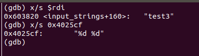
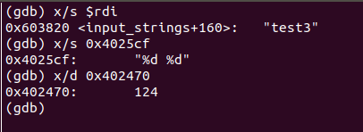


脑越用越灵，手越用越巧。


<!-- more -->

---


## 前言

没想到这BombLab果然有趣。一开始实验的时候还是有点困难的，主要是对GDB调试和一些知识点不够熟悉。虽然前面两个问题都有借鉴别人的方法。但是后面四个难度最大的真的是独立完成，完成的瞬间成就感不言而喻，达到climax。可能主要是对汇编有一点底子所以实验相对比较容易。


## CSAPP 实验记录



**[本系列文章](/tags/CSAPP-Lab/)主要记录 CSAPP 3.0 的实验过程，所有实验记录文章请查看[这儿](/tags/CSAPP-Lab/)**



快速开始请访问 `CSAPP` [Lab](http://csapp.cs.cmu.edu/3e/labs.html) 官网，本次实验记录是基于 CSAPP 3.0，实验日期始于：`2019-3-18`


## 实验开始前的归纳

 

这个实验首先要求对汇编有一定的掌握，所以在此就不列举汇编的相关内容了。个人感觉用到最重要也是想要入手必须要具备的知识：**一是学会使用反汇编及调试工具，二是了解函数调用的栈帧**。



### 栈帧

想要了解栈帧的结构？我们还是先来回顾（review）以下有哪些和函数栈相关的寄存器（这儿并没有包含浮点寄存器）吧。


- 所谓调用者保存，就是可以让被调用者（自身不作为另一个调用者）随意使用，也是为了自己用到的数据不被覆盖。
- 所谓被调用者保存，恰恰与调用者保存相反。
- 函数调用一般参数传递（非浮点）前6个参数存于寄存器，剩下的参数**按照函数定义从右向左压栈**。
- 栈指针指向函数栈栈顶。
- {% label primary@%rax%}用于保存函数调用返回值。


了解了这些寄存器，我们再来看看栈帧的结构


就拿函数P的栈帧来说，从栈底到栈顶的方向分别存储以下内容：

- 被保存的寄存器
- 局部变量（`sub $0x18,%rsp `）
- 如果调用其他函数参数多于6，便有参数构造区
- 调用其他函数时需要将返回地址压栈

### 工具使用方法

#### CGDB

跟随[孟佬](https://zhuanlan.zhihu.com/p/31269514)用的CGDB，[官网](https://cgdb.github.io/)及[gdb使用方式](http://csapp.cs.cmu.edu/3e/docs/gdbnotes-x86-64.pdf)，以下是CGDB运行缺省截图。


## Bomb Lab


BombLab家喻户晓，个人感觉之所以这个实验这么有名，主要有三点：

- 一是作为配套实验能够真正的训练学到的程序机器级表示的内容；
- 二是必不可少的一部分——实验的有趣性；
- 三是能够加强我们的调试程序的能力，终身受益（前提你是程序员:smile:）。


### 一开始

好了开始真正的实验部分了。

首先我们使用如下命令来开始调试`bomb`可执行程序：

```bash
cgdb bomb
```

就会看到如下界面：


这是给我们的主程序，里面主要是炸弹程序的初始化，以及这些炸弹的输入以及输入检测。

在CGDB模式下我们可以使用`:set disasm`命令将主程序以汇编形式展示，当然使用`:set nodisasm`就会返回原来的样子。


### 思路



所有炸弹拆除的思路都很简单，就是设断点，并一步步调试，找到跳转到`explode_bomb`的跳转命令，结合逻辑和寄存器的值进行判断如何避免跳转引发爆炸。



#### 运行

在GDB模式下，使用`run`命令开启调试。通过输入重定向的方法避免多次输入：`run < in.txt`

#### 设断点

在GDB模式下，使用`break 行号`打断点

#### 调试

设置断点后，具体参照GDB手册进行调试。

#### Example

比如想要破解Phrase1这个炸弹，需要执行以下步骤：

- 设置调用函数断点（`phrase_1(input)`处）
- 运行至断点处并调试（`stepi`+`nexti`+`finish`+`continue`等命令）
- 进入函数内部进一步观察（使用`print`+`x`等命令）
- 分析代码得出答案

### #Phrase Before

如果你是第一次做实验的话，这一步你一定要知道：


这六个炸弹都是都是通过一个`read_line`函数从输入流（不管是标准输入还是文件输入重定向）中读取的，返回值为`input`，对应于`%rax`寄存器（存放的一个输入字符串的首地址）。我们看到将`%rax`寄存器的内容转移到`%rdi`寄存器里了，我们知道寄存器`%rdi`用于存放调用函数时的第一个参数。接下来就调用炸弹函数了。


**再强调一遍，所有的炸弹函数的第一个参数`%rdi`都是我们输入的字符串的首地址。**


### #Phrase 1

第一个炸弹的汇编代码如下所示：


第一个算是一个入门的，主要是想让你熟悉一下BombLab的流程。

我们输入的字符串首地址在`%rdi`中；

②行申请了8个字节的栈空间；

③行将一个立即数（一看就是一个地址）存放到`%esi`寄存器（这是第二个参数）

④行调用了一个函数，如果你想快速通过的话不用看内部实现，是比较两个字符串是否相同。（内部比较就不说了，一个一个比较字符而已）


⑤行使用test命令（同`and`命令，不修改目标对象的值）来测试`%eax`中的值是否为0，如果为0则跳过引爆炸弹的函数。


很简单了，使用`x/s 0x402400`按字符串输出这个地址存储的内容（这个可能是我在比较字符串的函数内输出的 :smile: ）：


### #Phrase 2

第二弹，来吧勇士！（好吧，感觉有点中二。）


嗯，映入我们眼前的是一个<read_six_numbers>函数，一猜也是让我们输入6个数字。


### #Phrase 3







### #Phrase 4


### #Phrase 5


### #Phrase 6


