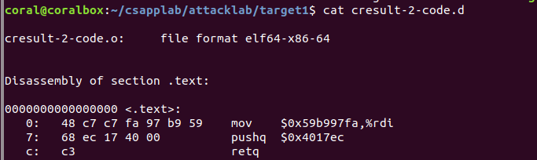
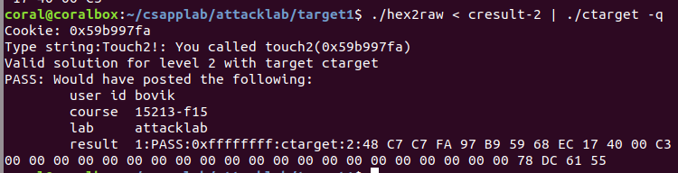
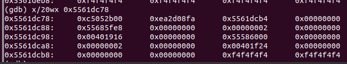


《深入理解计算机系统》之Attack Lab。


<!-- more -->

---

## 前言

开始第三个实验——Attack Lab了！本次试验还是基于第三章《程序的机器级表示》。

## 先来首歌Relax一下

比较好听的一首古风歌，与《霓裳羽衣曲》一字之差。唐朝诗人白居易在元和年间见到当时宫廷里表演的《霓裳羽衣曲》时，舞者“不著人家俗衣服。虹裳霞帔步摇冠，钿缨累累佩珊珊。”此曲此词皆有其意境。

<iframe frameborder="no"  marginwidth="0" marginheight="0" width=330 height=86 src="//music.163.com/outchain/player?type=2&id=1295233186&auto=1&height=66"></iframe>

## CSAPP 实验记录



**[本系列文章](/tags/CSAPP-Lab/)主要记录 CSAPP 3.0 的实验过程，所有实验记录文章请查看[这儿](/tags/CSAPP-Lab/)**


快速开始请访问 `CSAPP` [Lab](http://csapp.cs.cmu.edu/3e/labs.html) 官网，本次实验记录是基于 CSAPP 3.0，实验日期始于：`2019-3-25`

## 实验开始前的归纳

## Attack Lab

Attack分为两个部分，代码注入攻击和ROP（Return-Oriented Program）攻击，分别要对**Ctarget**程序和**Rtarget**程序进行攻击。

### Ctarget

针对于Ctarget程序的攻击，思路都是一样的：利用buffer溢出。首先利用buffer溢出修改callee的ret的返回位置，然后在ret位置可以注入代码进行操作，说的时髦一点就是攻击。

#### 如何操作

每做一个实验就需要熟悉具体的操作流程，虽然比较浪费时间，但是这确实能够增加我们的视野，而且能让我们了解许多知识，比如：

- 字节序，intel的字节序是小端法
- 代码注入不能为输入字符串的ASCII码，而是需要通过hex2raw方法输入原始字节序列

方式：
1. 通过**objdump**或者**gdb**确定一些需要的值，比如说**rsp**的值或者是某个函数的位置。
2. 编写注入代码，并用**gcc**汇编，用**objdump**获取指令及其编码
3. 将这些编码通过**hex2raw**输出为原始字节序

#### # Phase1


**目标：注入代码调用touch1函数。**


第一个，只是练手的，take it easy...

根据给出的test函数和touch1函数的代码，我们可以看出test函数并没有调用touch1函数，而是只调用了一个getbuf函数，这个函数就是获取输入的内容的，而getbuf函数允许最大输入0x28（十进制40）个字节。那么思路很明显了，只需要利用buffer溢出，修改ret的值就好了（因为栈内buffer的下面就是ret的返回地址了）。也就是说只需要输入40个字节任意字符+touch1的地址就好了。

结果如下：

#### # Phase2


**目标：注入代码传参并调用touch2函数。**


这个相对于第一个来说复杂了一点，要求你将cookie.txt文件里面的数值0x59b997fa作为参数调用touch2函数。

对于第一个phrase只需要直接输入字符串就行了，而第二个需要注入原始字节序代码了。

先说一下思路，因为需要传递参数，只需要传递一个，那就需要修改 **%rdi**寄存器的值，要想修改就必须用指令实现。我们需要做的就是写代码，注入，让程序跳转到我们注入代码的地方。

具体一点，思路如下：

因为一开始获取输入的都是getbuf函数，这一点和phrase1相同，这说明buffersize没变。所以我们还需要输入40个字节的字符和返回地址。我们要做的就是将返回地址修改为我们注入代码的地方，记为**addr**，我们需要将注入的代码放到哪里呢？buffer里完全够用，如果放到其他地方反而有可能造成segmentfault。从buffer首地址，也就是caller——getbuf函数一开始的rsp值开始注入我们的代码，这个rsp值也是我们需要跳转的值**addr**。

我们注入的代码有什么用？
- 修改 **%rdi**的值为0x59b997fa
- 控制交给touch2，因为不能用jmp和call，所以只能用ret来实现。

注入代码如下：

然后需要做的事就是将这段汇编代码用`gcc -c xxx`来汇编，并用`objdump -d xxx`来查看汇编指令对应的字节序列了（如上图）。
得到字节序列之后还需要将他和buffer的其他部分还有我们注入代码的首地址放入。然后通过hex2raw程序将其按照原始字节序列输入。

结束！运行结果如下：

#### # Phase3


**目标：注入固定字符串ASCII码序列并传首地址作为参数然后调用touch3函数。**


第三个和第二个差不多，只不过多了一点坑，同样是传递参数，只不过需要传一个字符串，而字符串需要自己保存，而且还有可能函数调用的过程中被其他数据覆盖。

我们先来思考一下需要哪些数据吧：

- cookie十六进制数的ASCII码值
- getbuf申请内存后的rsp值
- 要存取ASCII码序列的地址
- touch3地址

其他的都好确定，存取ASCII码序列的地址无法确定，有可能你第一次尝试是错误的。主要是因为touch函数调用了hexmatch函数，而这个函数对缓冲区进行了修改。

截了一下图。

**执行hexmatch函数前：**

**执行hexmatch函数后：**

我们发现第三行（0x5561dc98）之前的大多数都被修改了，所以我们要把数据继续放到栈的更底部位置。也就是从0x5561dca4之后的位置开始。那就简单了。

展示一下栈结构：

完事！

### Rtarget

下面开始ROP攻击，虽然需要利用buffer溢出来攻击，但是和代码注入攻击不同的是栈内的数据会不能当做指令来执行。所以需要使用一些程序中已经存在的代码区域的gadgets小工具来拼凑自己想要的指令序列。

#### # Phase4

第一弹，还是执行完getbuf函数就去执行touch2而不返回test函数。


**目标：利用gadget传参并调用touch2函数。**


​	

因为无法执行栈中的指令，所以只能通过已有代码来拼凑，那要拼凑成什么，首先还是看数据：

- cookie值

- touch2地址

  我们需要将cookie值传入rdi寄存器中，而cookie值只能通过输入保存到栈中，所以可以通过gadget根据指令编码找到一个pop命令pop到rdi中。但是遗憾的是farm前半部分并没有找到这个命令，所以我们只能另寻他法。最后我们可以通过pop先pop到rax中，然后使用mov命令将rax的值传入rdi中。

  我用到的是这两个gadget：一个包含`pop %rax`命令，一个包含`mov %rax,%rdi`命令。

  

  好了rdi中已经存储的cookie值了，下一步就是跳转到touch2了。

  怎么跳转？很简单，如果此时栈顶的元素是touch2的地址，并且接下来执行一条ret指令就OK了。

所以说很简单了，栈结构如下：

因为无法执行栈内代码，所以buffer合法部分已经没用了。

#### # Phase5

选做等于不做，好吧，是自己太菜了。到此为止95′已经到手，没必要争这5′了。了解一下内存栈的模型和这两种攻击手段就好了。

## 总结

本次实验整体提升不是很大，不过了解了两种攻击手段。

### 所感

- 自己还有些浮躁，有时静不下心来。
- 自己不应该有太多空闲时间，不然无所事事。
- 英语专业阅读水平有了一定的提高

### 所得

- 进一步了解了栈帧结构
- 了解了代码注入和ROP两种攻击手段，虽然现在已经很难适用了。

### 下一步

- 养成阅读英语书籍和文档的习惯
- 做好日常规划

