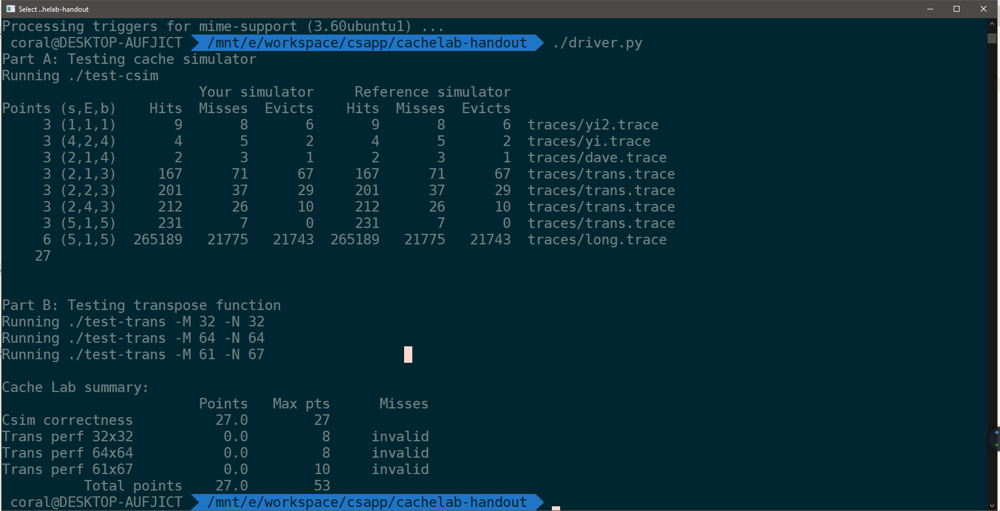


以软件的方式实现Cache。


<!-- more -->

---

## 结果



## 程序

实现一个Cache模拟器。


1. 输入：
   1. 指定组数量
   2. 指定组内行数量
   3. 指定行内块大小
   4. 指定访存文件
2. 输出：
   1. 命中数
   2. 未命中数
   3. 驱逐数
3. 算法：
   1. 驱逐使用LRU算法



其中，访存文件如下所示：

```bash part of trans.trace
I  00400570,3
 S 00600a98,4
I  00400573,4
 M 7ff000388,4
I  00400577,4
 L 7ff000388,4
```

## 算法

* Cache Line 数据结构：

```c
typedef struct
{
    bool valid; //valid bit
    // bool dirty;                   //if modified before
    unsigned long tag;            //tag bit for identifying the line in the group
    unsigned long last_used_time; //last used time for LRU algorithm detection
    //data

} Line;
```

* LRU驱逐算法：

每行指定一个上次使用时间（`last_used_time`），当某次访存出现miss并且组内无空余行时，比较上次使用时间最早的行并驱逐。

* 整体算法：



1. 获取参数：s、E、b、t
2. 给cache分配内存
3. 读取文件
4. 解析每一行：
    1. 获取非指令访存，获取访存地址，解析组索引、块偏移
    2. Load、Store一次访存，Modify两次访存
    3. 每次访存查找Cache：
        1. 找到内存块对应组
        2. 找组内是否有相同的标记，如果有则hit，结束查找；否则miss并下一步
        3. 找组内是否有空行，如果有则结束查找；否则需要eviction并下一步
        4. 找到组内上次使用时间最早的并驱逐，结束查找



## 代码

```c csim.c
#include "cachelab.h"
#include <stdio.h>
#include <stdlib.h>
#include <getopt.h>
#include <math.h>

typedef int bool;

#define true 1
#define false 0

unsigned long time = 0;

bool v_mode = false;
int s = 0, E = 0, b = 0;
char *file = "";

// statistics number
unsigned hit_count = 0, miss_count = 0, eviction_count = 0;
void getOpt(bool *v_mode, int *s, int *E, int *b, char **file, int argc, char **argv);
void access(unsigned long address);
typedef struct
{
    bool valid; //valid bit
    // bool dirty;                   //if modified before
    unsigned long tag;            //tag bit for identifying the line in the group
    unsigned long last_used_time; //last used time for LRU algorithm detection

    //data

} Line;

Line **cache = NULL;

int main(int argc, char **argv)
{

    // load options
    getOpt(&v_mode, &s, &E, &b, &file, argc, argv);

    // printf("%d %d %d %d %s %d\n", v_mode, s, E, b, file, (-(1U)) >> 28);

    // open the trace file
    FILE *trace_file = fopen(file, "r");

    // malloc the cache
    int S = 1<<s;
    cache = malloc(sizeof(Line *) * S);
    for (size_t i = 0; i < S; i++)
    {
        cache[i] = malloc(sizeof(Line) * E);
    }

    // initialize the cache line

    for (size_t i = 0; i < S; i++)
    {
        for (size_t j = 0; j < E; j++)
        {
            cache[i][j].last_used_time = 0;
            cache[i][j].tag = 0;
            cache[i][j].valid = 0;
        }
    }

    // read the trace file & resolve it

    char buffer[64];

    char type;
    unsigned long addr;
    int m_size;
    while (fgets(buffer, 64, trace_file))
    {
        sscanf(buffer, " %c %lx,%d", &type, &addr, &m_size);
        switch (type)
        {
        case 'L':
            access(addr);
            break;
        case 'M':
            access(addr);

        case 'S':
            access(addr);
            break;

        default:
            break;
        }
    }

    // free the memory
    for (size_t i = 0; i < S; i++)
    {
        free(cache[i]);
        cache[i] = NULL;
    }
    free(cache);
    cache = NULL;

    // close the trace file
    fclose(trace_file);

    printSummary(hit_count, miss_count, eviction_count);
    return 0;
}

void access(unsigned long address)
{
    // get the position
    int group = (address >> b)&((1 << s) - 1) ;
    int tag = address >> (b + s);
    // int bias = address & ((1 << b) - 1);

    // search for the tag
    // hit?
    for (size_t i = 0; i < E; i++)
    {
        if (cache[group][i].tag == tag && cache[group][i].valid == 1)
        {
            hit_count++;
            cache[group][i].last_used_time=++time;
            return;
        }
    }

    // miss and any empty
    for (size_t i = 0; i < E; i++)
    {
        if (cache[group][i].valid == 0)
        {
            cache[group][i].valid = 1;
            cache[group][i].last_used_time = ++time;
            cache[group][i].tag = tag;
            miss_count++;
            return;

        }

    }

    // miss and no empty
    eviction_count++;
    miss_count++;
    unsigned long lru_time = -1UL;
    unsigned line_index=0;

    for (size_t i = 0; i < E; i++)
    {
        if (cache[group][i].last_used_time < lru_time)
        {
            lru_time=cache[group][i].last_used_time;
            line_index=i;
        }
    }

    cache[group][line_index].last_used_time=++time;
    cache[group][line_index].tag=tag;

    printf("test\n");

}

void getOpt(bool *v_mode, int *s, int *E, int *b, char **file, int argc, char **argv)
{
    char opt;
    while ((opt = getopt(argc, argv, "v::s:E:b:t:ma")) != -1)
    {
        switch (opt)
        {
        case 'v':
            *v_mode = true;
            break;
        case 's':
            *s = atoi(optarg);
            break;
        case 'E':
            *E = atoi(optarg);
            break;
        case 'b':
            *b = atoi(optarg);
            break;
        case 't':
            *file = optarg;
            break;
        case '?':

            fprintf(stderr, "Usage: %s [-hv] -s <num> -E <num> -b <num> -t <file>\n\
Options:\n\
  -h         Print this help message.\n\
  -v         Optional verbose flag.\n\
  -s <num>   Number of set index bits.\n\
  -E <num>   Number of lines per set.\n\
  -b <num>   Number of block offset bits.\n\
  -t <file>  Trace file.\n\
\n\
Examples:\n\
  linux>  %s -s 4 -E 1 -b 4 -t traces/yi.trace\n\
  linux>  %s -v -s 8 -E 2 -b 4 -t traces/yi.trace\n",
                    argv[0], argv[0], argv[0]);
            exit(EXIT_FAILURE);

        default:
            break;
        }
    }
}
```