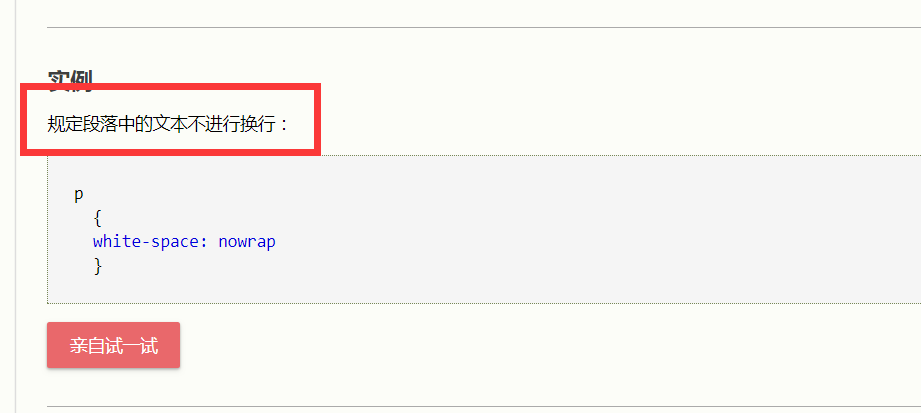
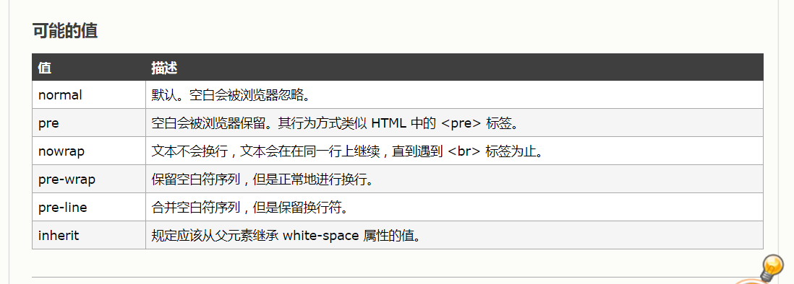
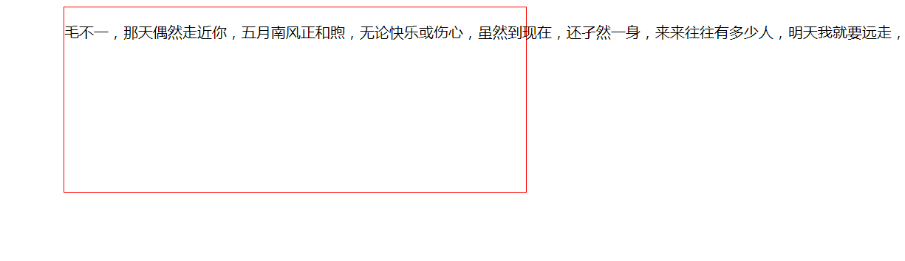

### 不幸罹难，掉坑

> 今天好尴尬，这次一定要记下来，一个css样式引发的血案。。在没怎么深入了解**white-space**这个属性的时候，果然应该感叹一句“前端博大精深，web前端博大精深”，感觉有学不完的css属性。


### 难之谓谁，坑之谓何

> 这样一个问题啊，遇到了一个不换行的p标签，瞬间就呆了。这是啥操作。然后自己写了几个测试。p标签设置了宽度、p标签有父元素div设置宽度、父元素div设置浮动、p标签设置浮动。。这几种情况p标签都会自动换行。然后百度，出来的都是设置什么break-word属性的，我试了，然并卵。。然后甚至搜到了如何让p标签不自动换行。。wtf，这种问题都有，我不知不觉就实现了？

### 大神降落 **@詹皇不夺三连冠不改网**

> 这位大神diao的一批啊，瞬间操作猛如虎，在浏览器的开发工具中调试p标签的各个属性。然后……

> 5分钟过后

> 然后，找到了white-space，把勾打掉，行了，又呆了。旁边翘楚的学长也两眼发光。

```css
.selector{
    white-space: nowrap;
}
```

### 真相大白



> 心中一万条草泥马奔腾而过……<br>
> 规定段落中的文本不换行，直到遇见 **\<br\>** 。然后我们再来看看这个属性都有哪些值吧。



> 看到这儿应该差不多明白了吧。<br>
然后又想这个属性应该怎么来理解呢？**nowrap**是什么意思呢？<br>
大神发话了：wrap是包裹，nowrap就是不包裹，不包裹了p标签里的元素就一口气冲到了p（其他文本）标签第一行的尽头。这个理解很赞！



> 不过需要强调的是，我这个是一个div标签包含p标签，而对div设置了**white-space:nowrap;**p标签会继承过来。而且文字会把div顶到左侧（div是设为右浮动的）。

```html
<!DOCTYPE html>
<!--[if lt IE 7]>      <html class="no-js lt-ie9 lt-ie8 lt-ie7"> <![endif]-->
<!--[if IE 7]>         <html class="no-js lt-ie9 lt-ie8"> <![endif]-->
<!--[if IE 8]>         <html class="no-js lt-ie9"> <![endif]-->
<!--[if gt IE 8]><!--> <html class="no-js"> <!--<![endif]-->
    <head>
        <meta charset="utf-8">
        <meta http-equiv="X-UA-Compatible" content="IE=edge">
        <title>段落换行测试</title>
        <meta name="description" content="">
        <meta name="viewport" content="width=device-width, initial-scale=1">
        <style>
            div{
                height: 200px;
                width: 500px;
                border: 1px solid red;
                float: right;
                white-space: nowrap;
            }
        </style>
    </head>
    <body>
        <!--[if lt IE 7]>
            <p class="browsehappy">You are using an <strong>outdated</strong> browser. Please <a href="#">upgrade your browser</a> to improve your experience.</p>
        <![endif]-->
        <div>
            <p>毛不一，那天偶然走近你，五月南风正和煦，无论快乐或伤心，虽然到现在，还孑然一身，来来往往有多少人，明天我就要远走，最后和你挥挥手。不会挽留</p>
        </div>
    </body>
</html>
```

### 啥时候用？

> white-space:nowrap 啥时候用呢？<br>
我想再设计一个走马灯效果的时候可以用nowrap这个属性。走马灯就是大街上那种电子屏幕广告，“麻辣香锅欢迎您！”，一次一次无限循环的那种。


