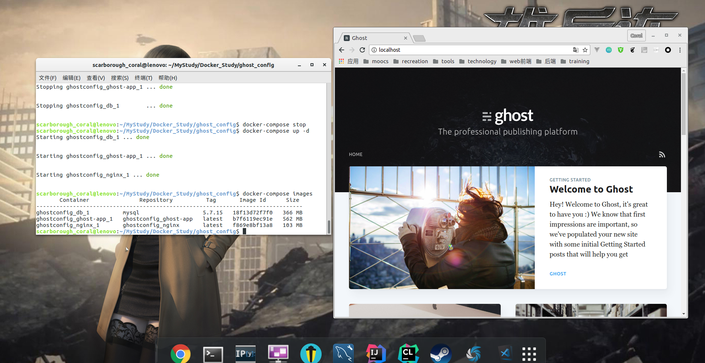


人类善用工具，是因为懒。


<!-- more -->
### Docker的本地博客

> 这是我用组合镜像工具搭建的一个本地博客，用到了nginx反向代理服务器，ghost博客镜像（npm包管理），还一个mysql镜像。

### 前言

> 最近弄了一下自己的[个人网站](http://scarboroughcoral.top)和博客，花了2块钱买了一年的域名。域名解析github page太让人欲罢不能，现在想来就吐血。这篇文章主要是写最近使用的一项技术，感觉逼格真高。但更重要的是非常方便。我猜测docker可能是以后老师检查课设的重要手段之一，嘘，猜测。从一开始学习使用，到搭建一个本地博客。这`docker`果然是个好东西。

### 拿来就用，不依赖第三方环境

> 就是这样，只要你的电脑上安装上docker，并且在[Docker Hub](https://hub.docker.com/)上有一个账号，你就可以从上面下载镜像并跑起来。正因如此，童鞋们可以将自己的课设通过docker打造镜像上传到`Docker Hub`上供老师们欣赏。不想原来那样，将自己的源代码打包发给老师，老师能不能运行起来都难说。

### 不同于虚拟机

> 我们知道虚拟机非常的大，一个就论G之算，而Docker镜像，往往你所需要的非常精简，甚者是说这镜像完全是为你打造的，你是需要将相应的文件加入其中，二次打造，就非常完美了，可以说是非常OK了！

### 概念

> 上次IBM讲座可以说是没怎么听，全程王者荣耀（坏笑）。对一些概念一知半解，比如说镜像和容器，仓库什么的。

#### 镜像和容器

> 个人理解，`镜像是死的，容器是活的`。就类似于虚拟机一样，你安装时需要的便是镜像，当你运行起来时对其文件进行操作，那便成了你挥洒笔墨的容器。程序和进程也是类似。

#### 仓库

> Docker仓库分为本地仓库和远程仓库，这类似于任何仓库类型的工具，比如npm包，github也是类似。这个仓库就是镜像仓库，当你需要一个镜像时，比如说nginx,ubuntu,arch,centos,mysql等等其中之一时，你需要进行pull操作，他会先从你的本地仓库去找，突然发现没有，然后他就去远程仓库了，找到了你想要的镜像，然后就给你运来了。

#### 命令

> docker有许多的命令。常见的就是这些

- pull 要一个镜像，类似git命令
- push 推送一个镜像，类似git
- build 打造合成
- run 运行
- ps 显示正在运行的容器
- images 显示本地有哪些镜像
- stop 停止容器
- rm 删除打造的镜像
- rmi 删除仓库中的镜像

> 就记得这些了,当然这只是基础的一些，其他的类似。

### Logo

> Docker的logo挺有意思的，一个小鲸鱼和一堆集装箱。docker的作用正如此logo，那些集装箱就是镜像，小鲸鱼就是docker端。当拿镜像时，你吩咐小鲸鱼去仓库运一个，它哧溜哧溜的先去本地仓库，我屮艸芔茻，没有，然后又呼哧呼哧的到远程仓库，然后哼登哼登的跑回来把他给你。你拿来这集装箱打开就用。没错，很六！

### 组合镜像

> 用了一个工具，[Docker Compose](https://docs.docker.com/compose/install/),我的本地博客就是用这玩意弄得，用到了nginx反向代理服务器，ghost博客镜像（npm包管理），还一个mysql镜像。