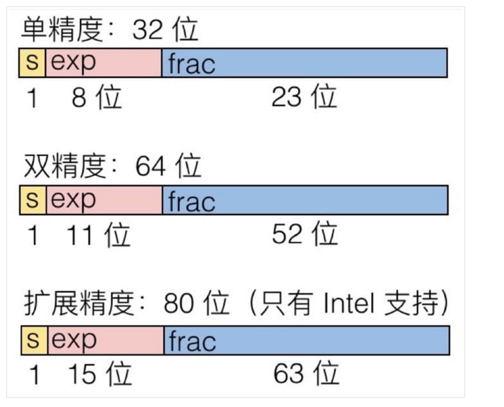


计算机的浮点数只能近似表示一些非常精确的数。


<!-- more -->

---

本篇文章是对的[《浮点数的二进制表示》](http://www.ruanyifeng.com/blog/2010/06/ieee_floating-point_representation.html)的思考过程。


## 前言

本来是想对CSAPP的的信息表示的浮点数表示做一下总结的，不过写了几百字后放弃了，主要是对浮点数还不够了解。不过看过阮一峰大神的文章之后，不禁大叹一声。这篇文章就想总结一下自己对浮点数的理解。

## 由一个题目说起

有一道C语言的练习题，是这样的

```c

#include <stdio.h>

void main(void){

　　int num=9; /* num是整型变量，设为9 */

　　float* pFloat=&num; /* pFloat表示num的内存地址，但是设为浮点数 */

　　printf("num的值为：%d\n",num); /* 显示num的整型值 */

　　printf("*pFloat的值为：%f\n",*pFloat); /* 显示num的浮点值 */

　　*pFloat=9.0; /* 将num的值改为浮点数 */

　　printf("num的值为：%d\n",num); /* 显示num的整型值 */

　　printf("*pFloat的值为：%f\n",*pFloat); /* 显示num的浮点值 */

}
```

运行结果如下：

```bash
coral@xx:~/workspace/csapp$ ./float
num的值为：9
*pFloat的值为：0.000000
num的值为：1091567616
*pFloat的值为：9.000000

```

- 第一行，直接输出num的值，这个毫无疑问是对的。
- 第二行，输出为什么为0？
> float和int类型的变量存储空间都是4个字节。令一个float类型的指针指向num的地址，然后通过`*float` 的方式访问，会将num地址内存储的内容以4字节浮点数解析。


- 第三行，输出为什么是一个类似乱码的数值？
> 将原来num变量的内容通过float类型的指针采取`*float`的方式赋值为9.0，然而输出的时候按照int的方式输出，所以解析错误，出现乱码。

- 第四行，这个就没有疑问了
> 通过float类型指针，然后通过float类型指针访问，所以解析方式是相同的，所以答案正如所料。


总之，这个题就是需要考虑int类型和float类型的存储格式。如果按照不同的方式解析肯定会出现错误。


## 一句话

内存只是一个字节数组而已，不管是float、int还是其他类型的变量，不过是内存中需要的大小或者是存储格式不同而已，无其他区别。

## int的存储格式

int是4字节类型，也就是32位。int的存储格式就是32位补码。这个不必多言，很好理解。这篇文章重点写浮点数的存储格式。 

## float的存储格式

float的存储格式正如下图，在这里我们只考虑简单的单精度浮点数和双精度浮点数：



### 科学计数法

因为浮点数的需求是要表示小数、特大数和非常接近零的数。当然由于浮点数精度总是有限的，所以有一些数值只能近似表示，而不能完全相等。

下面再来回想一下科学计数法，当然这我们很早之前就学过，比如下面这个数:

$$
    5.21\times10^{1314}
$$

如果我们不使用科学计数法的话就需要用1313位数字来表示，这样就太麻烦了。所以就采用了科学计数法来表示，用于节省“空间”。

### “二进制”科学计数法

与此目的相同，计算机为了表示一些数，就采用了“二进制”版本的科学计数法，比如数值7.0，就可以用以下“二进制”科学计数法表示：

$$
    1.11\times2^2
$$

它是怎么来的呢？因为7.0的二进制表示为111，将小数点左移两位，相应的就需要乘上$2^2$来使其相等。

浮点数的存储格式的想法就来自于此，因为这样能够大大减少存储空间，另外一个好处就是能够在误差允许的范围内表示非常大的数（$\pm\infty$）或者非常接近于0的数($f\to0$)。

浮点数一般用如下方式表示：

$$
(-1)^S\times M\times2^E
$$

- S用于表示浮点数的符号
- M用于表示有效数字，$1\leq M<2$
- E用于表示指数

所以计算机只需要存储这三部分即可。

### 单精度浮点数的存储格式

与想象的方式还有点不同，除了一些优化外，还需要遵守（abicd）一些约定。

下面的表格便是32位浮点数大端法表示的存储格式：

| sign（符号） | exp（指数） | frac（有效数字小数部分） |
| :----------: | :---------: | :----------------------: |
|     1位      |     8位     |           23位           |


- 32位浮点数的存储格式，大端法表示就是符号+指数+有效数字小数部分
- 因为有效数字必须满足 $1\le frac<2$，所以二进制的小数点前的一位总是1，所以省略不写
- 因为指数不仅需要表示正数次幂，也需要能表示负数次幂，可能是字节对齐的缘故（for the sake of ），所以指数部分不能采用补码形式表示，而是采用IEEE 754规定采用找中间数的方法，中间数总是$\lfloor\frac{2^{EMax}-1}{2}\rfloor$，比如8位指数，中间数就是$\lfloor\frac{2^8-1}{2}\rfloor=127$。在表示的时候需要将真实值＋中间数。
- E的规定
  - E不全为0并且不全为1。浮点数的值就是E减去中间数127得到指数真实值，然后有效数字小数部分M前面加上1
  - E全为0。浮点数的指数为1-中间数（32位浮点数为1-127），有效数字前不再＋1，这样就为0.xxxx的小数，而且可以表示非常接近于0的数。
  - E全为1。如果有效数字全为0，则表示$\pm\infty$；否则就表示这不是一个数 ***NaN***。

### 双精度浮点数的存储格式

解析方法与单精度浮点数相同，存储格式类似。
下面的表格便是64位浮点数大端法表示的存储格式：

| sign（符号） | exp（指数） | frac（有效数字小数部分） |
| :----------: | :---------: | :----------------------: |
|     1位      |    11位     |           52位           |


## 例题题解

```c

#include <stdio.h>

void main(void){

　　int num=9; /* num是整型变量，设为9 */

　　float* pFloat=&num; /* pFloat表示num的内存地址，但是设为浮点数 */

　　printf("num的值为：%d\n",num); /* 显示num的整型值 */

　　printf("*pFloat的值为：%f\n",*pFloat); /* 显示num的浮点值 */

　　*pFloat=9.0; /* 将num的值改为浮点数 */

　　printf("num的值为：%d\n",num); /* 显示num的整型值 */

　　printf("*pFloat的值为：%f\n",*pFloat); /* 显示num的浮点值 */

}
```

```bash
coral@xx:~/workspace/csapp$ ./float
num的值为：9
*pFloat的值为：0.000000
num的值为：1091567616
*pFloat的值为：9.000000

```

1. 第二行，为什么是0.00000？



执行`printf("*pFloat的值为：%f\n",*pFloat);`语句时，变量存储空间内是存储的int类型的9，二进制表示为0000-0000-0000-0000-0000-0000-0000-1001，但是输出使用float指针类型索引，所以按照此类型解析的话，二进制解析为0-00000000-00000000000000000001001，所以指数E为全0。浮点数真值为：


$$
V=(-1)^0×0.00000000000000000001001×2^{-126}=1.001×2^{-146}
$$
数值几乎为0，所以答案就明了了。



2. 第三行，为什么是1091567616？



这个同理了，只不过是反向思考。

首先用float指针将数值设置为9.0。9的二进制表示为1001，用”二进制“科学计数法表示为$1.001\times2^3$，所以S为0，E为3+127=130（二进制为10000010），有效数为001，所以变量存储的内容为0-10000010-00100000000000000000000，然后将这个值用int类型解析，0100-0001-0001-0000-0000-0000-0000-0000，结果为1091567616。

