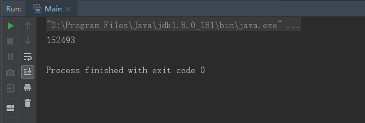

## 前言

高并发问题是大学课程中讲的比较少的课题，打算寒假期间恶补这一部分内容，多线程问题是高并发的子问题，或者说多线程是高并发问题解决方案的一部分。如果一个学计算机的不熟悉多线程，不知道原理，那怕让别人笑掉大牙。

## 为什么用并发手段？不用并发手段的后果是什么？

> 在 `Java` 中，假设有一个 `Runnable` 实现类，类中有变量 `i`，`run` 方法中执行100000对其加1操作。实例化两个线程对象，用 `Runnable` 实现类的实例作为参数，开启线程会发生什么情况？

#### 代码

```java
/**
 * Created with MingYue Li.
 * Description:
 * User: Lenovo
 * Date: 2019-01-08
 * Time: 14:46
 */
public class Main {
    public static void main(String[] args) throws InterruptedException {
        AddOne addOne = new AddOne();
        Thread t1 = new Thread(addOne);
        Thread t2 = new Thread(addOne);
        t1.start();
        t2.start();
        t1.join();
        t2.join();
        System.out.println(addOne.getI());
    }

    static class AddOne implements Runnable{
        private int i=0;
        @Override
        public void run() {
            for (int j = 0; j < 100000; j++) {
                i++;
            }
        }

        public int getI() {
            return i;
        }

        public void setI(int i) {
            this.i = i;
        }
    }
}

```

#### 结果
> 执行结果一般不会为理想的200000，执行多次结果不定相同




#### 分析
如果对代码的原子性问题有所涉猎的话，肯定就知道，这个是原子性问题。为什么？因为`i++`操作不是原子操作：

- 读取 `i` 值
- 将 `i` 值加1
- 将加1后的 `i` 值写入内存

这有点像把大象装入冰箱分几步……

言归正传，`i++` 操作分三步，如果这三步是原子性的，那结果是100%是200000没错了；如果不是原子的，第一个线程读取 `i` ，修改后还未准备存入内存，这时候第二个线程读取 `i` 值，这时候第二个线程读取的 `i` 值不是最新的，这时候不管谁先写回内存都少了1次，所以以上代码的输出结果总是 `<=200000` 的。

#### 后果

想想后果就很可怕，如果你的银行业务出现了类似的问题还不得亏的头皮发麻……，所以金融领域对高并发问题非常注重。其他类似行业也大多如此，对于由高并发引起的问题对用户造成损失的，必定会更加关注高并发的解决方案。毕竟用户就是上帝。

## 使用 Synchronized
> 了解 `Java` 多线程就要了解 `Synchronized` 关键字。

#### 分类

- 对象锁
> 包括方法锁（默认锁对象为 `this` 当前实例对象）和同步代码块锁（自定义锁对象）

- 类锁
> 修饰静态方法或指定锁为 `Class 对象`


> 未完待续……