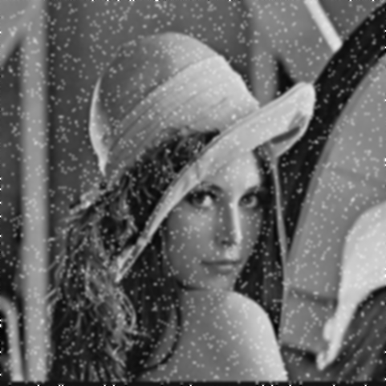



大漠孤烟直？长河落日圆！



<!-- more -->

---

## 前言

这次的实验主要是对图像进行**图像平滑**处理，**图像锐化**也是类似的方法。

首先解决存惑已久的概念，什么是空间域？



### 图像增强方法

图像增强方法分为两大类：**空间域方法**和**频域方法**

- 空间域”是指图像平面自身，这类方法是以对图像的像素直接处理为基础
- “频域”处理技术是以修改图像的傅氏变换为基础（以后会总结）



## 实验任务

- 平均处理（基于模板卷积运算）
- 中值滤波
> 说明：上述处理需要对边界点进行处理，2种方法

模板在[DIP 中常见的核](digital-image-kernel-collection.html)一文中总结过，如果不清楚概念可以查看一下。

### 任务解析

两次实验都是为了进行图像平滑处理，主要目的是消除噪声或模糊图像，去除小的细节或弥合目标间的缝隙。

- 平均处理（基于模板卷积运算），对图像每个像素进行模板内像素的平均化求值并更新中心像素。
- 中值滤波，对图像每个像素进行模板内像素的中位数求值并更新中心像素。
- 边缘处理，两种方法：不处理；扩充图像。


## 任务Start

首先展示一下原图（因为需要找噪声比较明显的图像，所以没找到像素比较大的和attractive的 :cry:）：


### 平均处理

比较常见的有两种平均处理核：

- 第一种

$$
    \frac{1}{9}\times
    \begin{bmatrix}
        1&1&1\\\\
        1&1&1\\\\
        1&1&1
    \end{bmatrix}
$$

- 第二种

$$
    \frac{1}{16}\times
    \begin{bmatrix}
       1&2&1\\\\
       2&4&2\\\\
       1&2&1 
    \end{bmatrix}
$$

实现是采用的是第一种。

#### 代码

```c
void AverageProcessing(const char * src, const char * output)
{
	BMFILEHEADER header;
	INFOHEADER info;


	unsigned char ** data = malloc(sizeof(unsigned char*));
	RGBQUAD ** palette = malloc(sizeof(RGBQUAD*));
	unsigned pixelCounts = BMPReader8(src, &header, &info, palette, data);

	unsigned char **outData = malloc(sizeof(unsigned char*));

	*outData = malloc(pixelCounts);


	for (unsigned i = 0; i < info.height; i++)
	{
		
		for (unsigned j = 0; j < info.width; j++)
		{
			if (i == 0 ||( i == info.height - 1)|| j == 0 || (j == info.width - 1))
			{
				*(*outData + i * info.width + j) = *(*data + i * info.width + j);
				continue;
			}
			int newGray = *(*data + (i - 1) * info.width + (j - 1)) +
				*(*data + (i)* info.width + (j - 1)) +
				*(*data + (i + 1)* info.width + (j - 1)) +
				*(*data + (i - 1)* info.width + (j)) +
				*(*data + (i)* info.width + (j)) +
				*(*data + (i + 1)* info.width + (j)) +
				*(*data + (i - 1)* info.width + (j + 1)) +
				*(*data + (i)* info.width + (j + 1)) +
				*(*data + (i + 1)* info.width + (j + 1));
			newGray /= 9;
			*(*outData + i * info.width+j) = newGray;
		}
	}

	BMPWriter8(output, &header, &info, palette, outData);

}
```

#### 运行结果

采用一次迭代和三次迭代，一次迭代可能效果不够明显，所以采用多次迭代。但是也会对原图的准确数据造成模糊。

- 一次迭代运行结果


- 三次迭代运行结果


### 中值滤波


#### 代码

```c
void MedianFiltering(const char * src, const char * output)
{
	BMFILEHEADER header;
	INFOHEADER info;


	unsigned char ** data = malloc(sizeof(unsigned char*));
	RGBQUAD ** palette = malloc(sizeof(RGBQUAD*));
	unsigned pixelCounts = BMPReader8(src, &header, &info, palette, data);

	unsigned char **outData = malloc(sizeof(unsigned char*));

	*outData = malloc(pixelCounts);


	for (unsigned i = 0; i < info.height; i++)
	{

		for (unsigned j = 0; j < info.width; j++)
		{
			if (i == 0 || (i == info.height - 1) || j == 0 || (j == info.width - 1))
			{
				*(*outData + i * info.width + j) = *(*data + i * info.width + j);
				continue;
			}
			int newGrays[] = { *(*data + (i - 1) * info.width + (j - 1)) ,
				*(*data + (i)* info.width + (j - 1)) ,
				*(*data + (i + 1)* info.width + (j - 1)) ,
				*(*data + (i - 1)* info.width + (j)) ,
				*(*data + (i)* info.width + (j)) ,
				*(*data + (i + 1)* info.width + (j)) ,
				*(*data + (i - 1)* info.width + (j + 1)) ,
				*(*data + (i)* info.width + (j + 1)) ,
				*(*data + (i + 1)* info.width + (j + 1)) };
			quicksort(newGrays, 0, 8);
			int newGray = newGrays[4];
			*(*outData + i * info.width + j) = newGray;
		}
	}

	BMPWriter8(output, &header, &info, palette, outData);
}

```

#### 运行结果

与均值处理类似，中值处理也分别采用1次和3次迭代。

- 一次迭代运行结果


- 三次迭代运行结果


### 结果

整体看一下效果，可以打开一个图进行左右切换对比。

- 原图


- 平均处理（一次处理）


- 平均处理（三次迭代）


- 中值滤波（一次处理）


- 中值滤波（三次迭代）


### 两者对比

很明显，中值滤波处理方法更优。平均处理方法在模糊噪声的同时也一定程度的模糊的关键像素，会产生新的灰度值；而中值滤波只会选取已有的灰度值进行取值。


## 总结


**全部代码请查看[GitHub](https://github.com/ScarboroughCoral/DIPModule)**




本次实验相对比较简单，主要是因为前几天对一些BMP文件的处理做了一定的封装，把精力放到图像处理上来。图像锐化的内容也和本次实验类似，只是去了不同的“核”来处理。