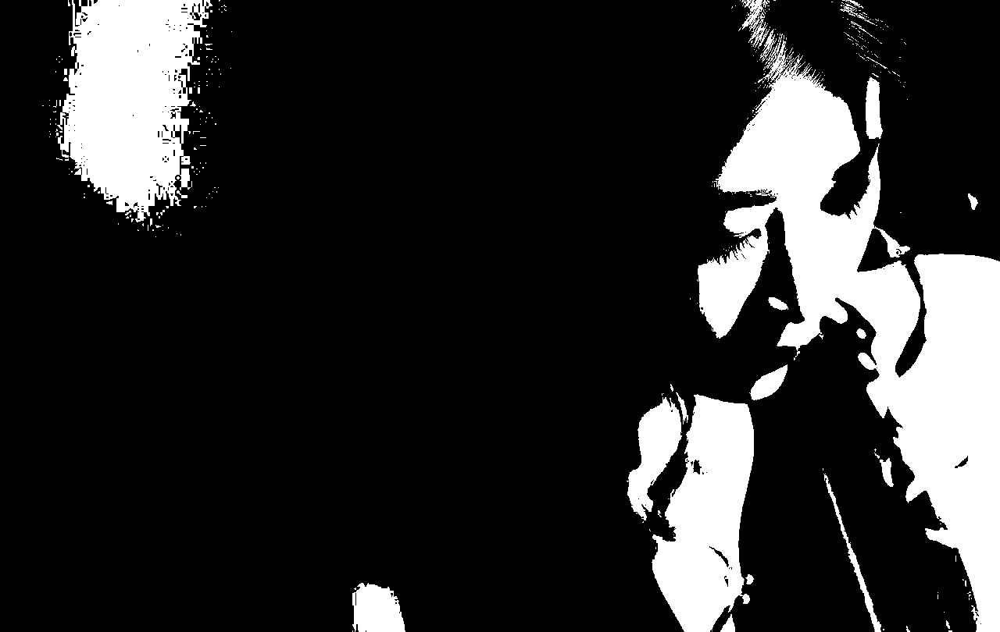
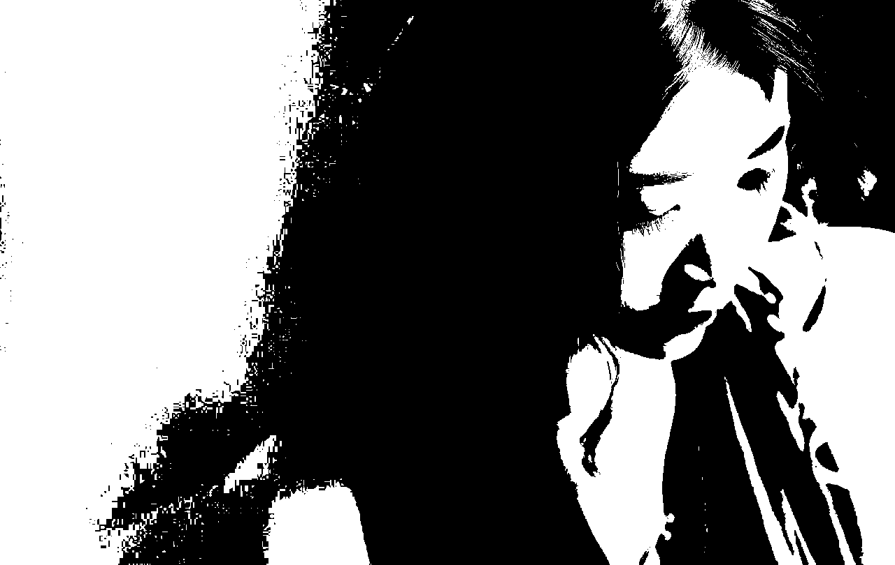
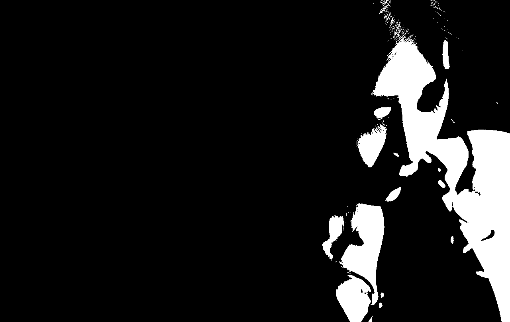
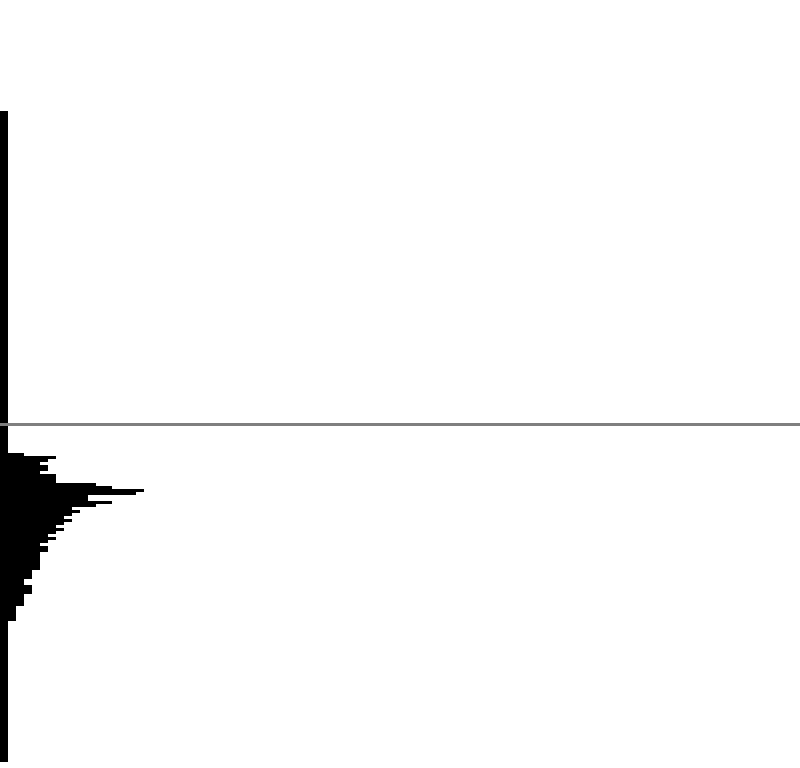


图像基于阈值分割的二值化处理。


<!-- more -->

---

## 前言



**全部代码请查看[GitHub](https://github.com/ScarboroughCoral/DIPModule)**



上次做了图像物体边缘检测，不过由于课程并没有讲完，只做了部分，待总结。这次做的是图像分割中的阈值分割。

阈值分割是一种图像分割方法，用于分割不同物体，比如说前景和背景的分割、图片中关键信息的提取（如下图，来自网络）。本次实验是针对8位灰度图的二值化处理。


数字图像处理全部实验博客总结请查看[扶桑树叶之DIP](/tags/DIP/)


## 音乐

古风，善。

<iframe frameborder="no"  marginwidth="0" marginheight="0" width=330 height=86 src="//music.163.com/outchain/player?type=2&id=32432321&auto=1&height=66"></iframe>

## 实验内容

> **要求：在直方图上标记出计算出的阈值、生成二值化后的图像**

1. 给定阈值T
2. 双峰法（极小点阈值法）（选做——就是不做）
3. 迭代阈值法
4. Otsu(大津算法)

## 实验过程

### 0x01 先晒原图

- 原图

然后转换为8位灰度图，对8位灰度图进行二值化处理。

- 转8位灰度图

### 0x02 人为观察直方图给定阈值T进行二值化

最简单了，权当练手。
方法就是对8位灰度图每个像素进行如下处理：
- 灰度大于T，灰度设为255
- 灰度小于T，灰度设为0

***结果如下：***

***相应的直方图，灰色线条为所选的阈值，图像从下向上灰度增加***

这样看来是有一定问题的，并没有完全将前景和背景分割出来。

### 0x03 使用迭代法进行二值化处理

该算法适用于背景和对象在图像中占据的面积相近的情况。


算法思想：利用平均灰度作为指标，将图片分为低灰度和高灰度两部分，根据两部分平均灰度求原图“新平均灰度”并比较两个平均灰度，如果满足误差条件，即停止迭代。

具体步骤：

1. 选择图像灰度的中值（我选的是平均灰度）作为初始阈值$T_i=T_0$。
2. 利用阈值Ti把图像分割成两部分区域，$R_1$和$R_2$，并计算其灰度均值$\mu_1$和$\mu_2$
3. 计算新的阈值$T_{i+1}=\frac{1}{2}\times(\mu_1+\mu_2)$
4. 重复步骤2、3，直到$T_{i+1}$和$T_i$的值差别小于某个给定值

***结果如下：***

***相应的直方图，灰色线条为所选的阈值，图像从下向上灰度增加***

这样看来是有一定问题的，并没有完全将前景和背景分割出来。

### 0x04 otsu大津算法

算法思想：针对二值化，将图片区域分为两类，根据两类的类间方差最大（或者类内方差最小）来进行分割。针对多类分割也是同理。当然我自己还没有完全搞懂为啥是这个情况，数学是硬伤，太菜了。



**二值化类间方差公式**
类内方差的最小化与类间方差的最大化是一致的优化目标。

$$
\sigma^2=\omega_1\omega_2\times(\mu_1-\mu_2)^2
$$

- $\mu_1$和$\mu_2$分别是两个类的平均灰度
- $\omega_1$和$\omega_2$分别是两个类的像素占比，即概率



具体步骤：
> 采取类间方差最大的方法来进行二值化

1. 初始化类间方差$\omega^2=0$
2. 初始化阈值$i=1$
3. 求得阈值$i$下的类间方差$\omega^2_i$
4. 如果$\omega^2_i\gg\omega^2$则替换之
5. 增加阈值$i=i+1$
6. 重复3、4、5步

***结果如下：***

***相应的直方图，灰色线条为所选的阈值，图像从下向上灰度增加***

效果较好，这也是为什么当前仍然使用这个算法的原因。

## 总结

本次实验对阈值分割有了一定的了解，针对二值化做了实验，使用了迭代和otsu两种算法进行二值化处理，学到了不少，但是其中的原理还是没有搞清楚，希望以后能有机会深入研究一下。

