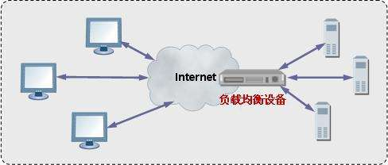

<blockquote class="blockquote-center">程序员具备的最有利而未被利用的技能就是，使虚拟和现实自动化的能力。
</blockquote>

### 前言
> 最近两天看了本书，`《Ubuntu Server最佳实践》`，今天打算写一篇博客了，为什么呢。因为我大概搞清楚了学校的网络情况，恩，大概。就是经常所谓的`内网`和`外网`。

### 解释
这是我的个人见解，毕竟只是一个小白，而且学校网络管理的大牛毕竟也多。
> 首先说一下代理。面向对象设计模式中有代理模式，无非就是继承和组合；我平时看一些技术文章也看到过代理，但更多的是反向代理，比如nginx。那什么是正向代理，什么是反向代理呢？以下只是我的个人见解，可能有纰漏或是错误，如果不能理解可以直接参考[百度百科](https://baike.baidu.com/item/%E5%8F%8D%E5%90%91%E4%BB%A3%E7%90%86/7793488?fr=aladdin)。

#### 正向代理

正向代理就是我们正常所说的代理，当你在学校登录一个公网网站比如说`百度`，因为你是属于内网之中的，所以你需要一扇窗户来看到外面的世界（我感觉这有点像在国内访问Google），没错，这扇窗户就是代理服务器，我认为他起到网关的作用。从内部计算机通过代理服务器访问到外面的网络，这就是正向代理。

#### 反向代理

反向代理与正向代理恰恰相反，这在一些大型网站中运用的比较多，比如双十一的淘宝，数亿的消费额，大量的用户，超多的访问量，想不到的还以为是在给阿里的服务器做一次大型的压力测试。实际上这对阿里的服务器来说没问题，个人看法，利用了反向代理，通过负载均衡，就像下面的图一样：

左边是用户的电脑们，很多很多，用户通过电脑访问阿里的服务器，发起无数请求，如果只有一台服务器，这肯定炸了。但是服务器有很多台，而用户PC和阿里服务器之间有一个负载均衡，这玩意就是反向代理服务器（玩docker的时候用过nginx反向代理）。将用户对某一地址发起的请求分发到内网中的各个服务器中（不是轮循，有一定的算法）。这就是反向代理，可以对比一下正向代理，刚好倒过来。

#### 学校的网

咳咳，有点偏题了。再继续说学校的网，学校的网是正向代理，内网主机通过正向代理服务器到外面的世界。下面我们再仔细探讨一下细节。

> 我们一开始需要缴费，一个月20大洋，然后需要通过用户名密码登录才能上网，这肯定是有一个管理系统在其中。然后还发现有些网站在家能正常访问，但一回学校，GG了。

##### 原理猜测

我在`《Ubuntu Server最佳实践》`这本书中看到了一种实现方式，讲到的是一个名为`squid`的代理服务器。前面说到过学校的代理服务器是一个网关（gateway），俗一点就是走向世界的大门。一般来说这种代理服务器会有至少两个网卡，一个是联通内网的，一个是通向外网的。而怎么实现让内网里的主机只能走而且能走到代理服务器这个大门呢？`个人理解，若果有错请指正` 这就需要设置用户主机的代理服务器了。如下图是Google浏览器的设置方式：

不对啊，我们没有配置啊。没错这就需要另一个东西叫`DHCP（Dynamic Host Configuration Protocol，动态主机配置协议）`，这玩意能让你自动获取IP。当然DHCP应该也需要搭建服务器。然后登录后才能访问呢，登录不了为什么不能访问外网？`squid`中可以配置代理服务器设置内网主机需要的用户账号密码名单，而且能配置用户的访问外网的白名单和黑名单，这就是为什么有些网站在家能够访问而在校就挂了。

### 结语
> 感觉这次的博客写的有些恶心了，冗余而且繁杂。还可能有些错，希望大佬们正确指出。