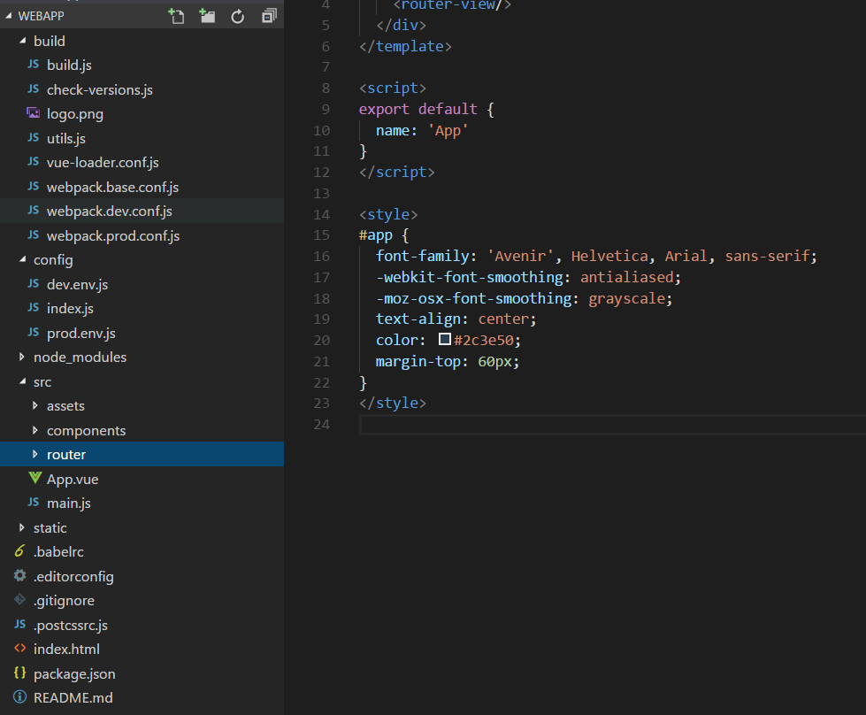

### 前言

> 回顾Vue。

### vue + webpack 架构解析

> 先对整体架构进行解析，整个项目需要哪些文件，文件之间的联系是什么，各司何职。

- build
    - build.js 
        >  构建配置
    - webpack.base.conf.js
         > webpack基本配置，用于开发和生产webpack配置继承
    - webpack.dev.conf.js
         > webpack开发时配置
    - webpack.prod.conf.js
         > webpack生产配置
    - vue-loader.conf.js
    - utils.js
    - check-versions.js
- config
    - index.js
         > 对工程进行配置，例如设置端口等
    - dev.env.js
    - prod.env.js
- node_modules
     > 项目依赖模块
- src
    - assets
         > 一些资源，例如图片
    - components
         > 一些组件，例如导航栏，图片轮播组件等
    - router
        - index.js
            > 路由配置文件
    - App.vue
         > 最大的父组件
    - main.js
         > 入口文件
- static
     > 静态文件
