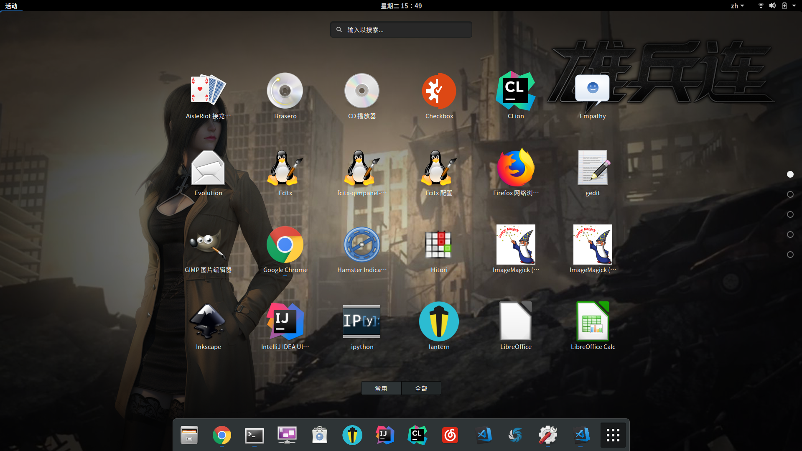
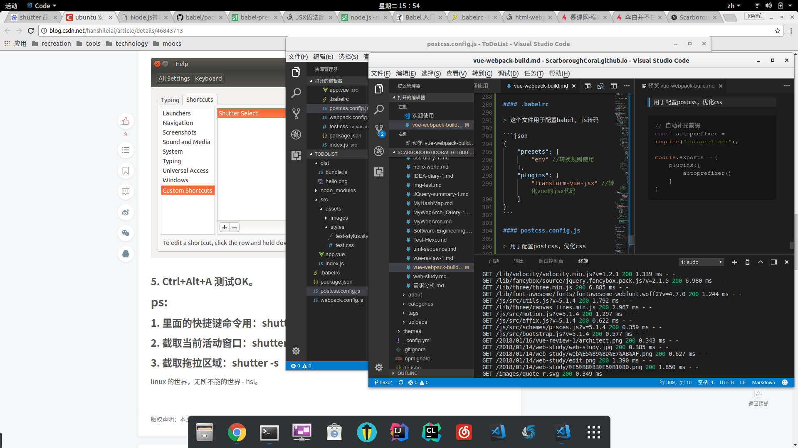

<blockquote class="blockquote-center">人的一切痛苦，本质上都是对自己无能的愤怒。
</blockquote>

### 前言
>   开发编码不是大问题，环境架构搭建，使工程变得轻量简洁才关键。今天简单总结一下vue+webpack项目的简单配置。

### 启动

> 首先我们使用npm来管理项目，所以一开始我们就需要干一件事，初始化。

``` bash
npm init
```
> 中间过程略过，大致让你填一下项目信息，然后创建了一个 **package.json** 文件


> 当你创建的一个 **.vue** 文件，流畅的写好了你想写的代码，却不知道如何以HTML的形式展现出来，这时候就感觉gg了，对于webpack来说能很好地解决这个问题，所以我们在安装vue的同时安装webpack

```bash
npm i vue vue-loader webpack vue-template-compiler
```

> vue-loader的作用就是识别 **.vue**文件，将其转化为js模块。
vue-template-compiler是预编译vue文件为渲染函数。

> 另外对于样式，图片都需要相应的loader来识别转化模块

```bash
npm i css-loader style-loader url-loader file-loader stylus-loader 
```

> 然后你就可以创建一个 **app.vue**的文件，然后暴露给webpack。

```html
<!-- app.vue -->
<template>
  <div id="test">{{text}}</div>
</template>

<script>
export default {
  data(){
      return {
          text:"abcds"
      };
  }
}
</script>
<style>
    #test{
        color: red;
    }
</style>

```
> webpack需要一个入口文件来加载你所需要的模块，这时候你创建了一个index.js

```javascript
// index.js
import Vue from 'vue';
import App from './app.vue'
import './assets/images/hello.png';
import './assets/styles/test.css';
import './assets/styles/test-stylus.styl'

const root = document.createElement("div");
document.body.appendChild(root);

new Vue({
    render:(h) => h(App)
}).$mount(root)
```

> 然后需要将这个文件让webpack知道它是一个入口文件，创建一个webpack配置文件，**webpack.config.js** ,在开发过程中webpack-dev-server会提高开发效率。

```js
const path = require("path");
const HTMLPlugin = require('html-webpack-plugin');
const webpack = require('webpack')

const isDev = process.env.NODE_ENV === 'development';
const config = {
    target:'web',
    entry: path.join(__dirname,'src/index.js'),
    output:{
        filename :"bundle.js",
        path: path.join(__dirname,'dist')
    },
    module:{
        rules:[
            {
                test:/\.vue$/,
                loader:'vue-loader'
            },
            {
                test: /\.css$/,
                use:[
                    'style-loader',
                    'css-loader',
                ]
            },
            {
                test:/\.styl/,
                use:[
                    'style-loader',
                    'css-loader',
                    {
                        loader:'postcss-loader',
                        options:{
                            sourceMap:true,
                        }
                    },
                    'stylus-loader'
                ]
            },
            {
                test:/\.(gif|jpg|png|jpeg|svg)$/,
                use:[
                    {
                        loader:'url-loader',
                        options:{
                            limit:1024,
                            name:'[name].[ext]'
                        }
                    }
                ]
            }
        ]
    },
    plugins:[
        new webpack.DefinePlugin({
            'procss.env':{
                NODE_ENV:isDev?'"development"':'"production"'
            }
        }),
        new HTMLPlugin()
    ]
}

if(isDev){
    config.devtool = '#cheap-module-eval-source-map';
    config.devServer = {
        port:8000,
        host:'0.0.0.0',
        overlay:{
            errors:true,
        },
        hot:true,
        // open:true
    }
    config.plugins.push(
        new webpack.HotModuleReplacementPlugin(),
        new webpack.NoEmitOnErrorsPlugin()
    )
}

module.exports = config;
```

> 然后在**package.json**中配置运行脚本

```json
// package.json
{
  "name": "todolist",
  "version": "1.0.0",
  "description": "",
  "main": "index.js",
  "scripts": {
    "test": "echo \"Error: no test specified\" && exit 1",
    "build": "cross-env NODE_ENV=production webpack --config webpack.config.js",
    "dev": "cross-env NODE_ENV=development webpack-dev-server --config webpack.config.js"
  },
  "author": "",
  "license": "ISC"
}

```

> 然后 **npm run dev** 便可以启动了


### 配置文件详解

#### webpack.config.js

```javascript
const path = require("path");  //用于处理项目中的路径问题的模块包
const HTMLPlugin = require('html-webpack-plugin'); // 将入口文件自动配置到html中
const webpack = require('webpack')

const isDev = process.env.NODE_ENV === 'development'; //判断是否是开发环境，在运行npm脚本时决定
const config = {
    target:'web',
    entry: path.join(__dirname,'src/index.js'), //配置入口文件地址，__dirname为项目根目录
    output:{
        filename :"bundle.js",
        path: path.join(__dirname,'dist')
    }, //用于配置打包后的文件名和路径
    module:{  //配置模块
        rules:[  //配置各种规则
            {
                test:/\.vue$/,
                loader:'vue-loader' 
            }, //遇到vue文件会使用vue-loader来识别转化
            {
                test: /\.css$/,
                use:[
                    'style-loader',
                    'css-loader',
                ]
            }, //遇到css文件先通过css-loader来处理，再交给style-loader来处理
            {
                test:/\.jsx/,
                loader:'babel-loader'
            },
            {
                test:/\.styl/,
                use:[
                    'style-loader',
                    'css-loader',
                    {
                        loader:'postcss-loader',
                        options:{
                            sourceMap:true,
                        }
                    },
                    'stylus-loader'
                ]
            },//遇到styl文件通过stylus-loader处理后生成css，通过postcss-loader进行预处理，再上抛
            {
                test:/\.(gif|jpg|png|jpeg|svg)$/,
                use:[
                    {
                        loader:'url-loader',
                        options:{
                            limit:1024,
                            name:'[name].[ext]'
                        }
                    }
                ]
            } //遇到图片使用url-loader，输出为原文件名，当遇到大小小于1024时会转化为base64代码，不生成图片文件。
        ]
    },
    plugins:[
        new webpack.DefinePlugin({
            'process.env':{
                NODE_ENV:isDev?'"development"':'"production"'
            }
        }),//定义插件，
        new HTMLPlugin() //html-webpack-plugin
    ]
}

if(isDev){ //若是开发环境使用webpack-dev-server
    config.devtool = '#cheap-module-eval-source-map'; //开发时f12修改源文件而不是打包文件
    config.devServer = {
        port:8000,
        host:'0.0.0.0', //这样配置可以通过内网访问
        overlay:{
            errors:true,
        },
        hot:true, //增加热更新功能，需要以下两个插件
        // open:true  //服务器启动后打开主页
    }
    config.plugins.push(
        new webpack.HotModuleReplacementPlugin(),
        new webpack.NoEmitOnErrorsPlugin()
    )
}

module.exports = config;
```

#### .babelrc

> 这个文件用于配置babel，js转码

```json
{
    "presets": [
        "env" //转换规则使用
    ],
    "plugins": [
        "transform-vue-jsx" //转化vue的jsx代码
    ]
}
```

#### postcss.config.js

> 用于配置postcss，优化css

```js
// 自动补充前缀
const autoprefixer = require("autoprefixer");

module.exports = {
    plugins:[
        autoprefixer()
    ]
}
```

### blah blah

> Gnome 感觉清爽的六



---




---