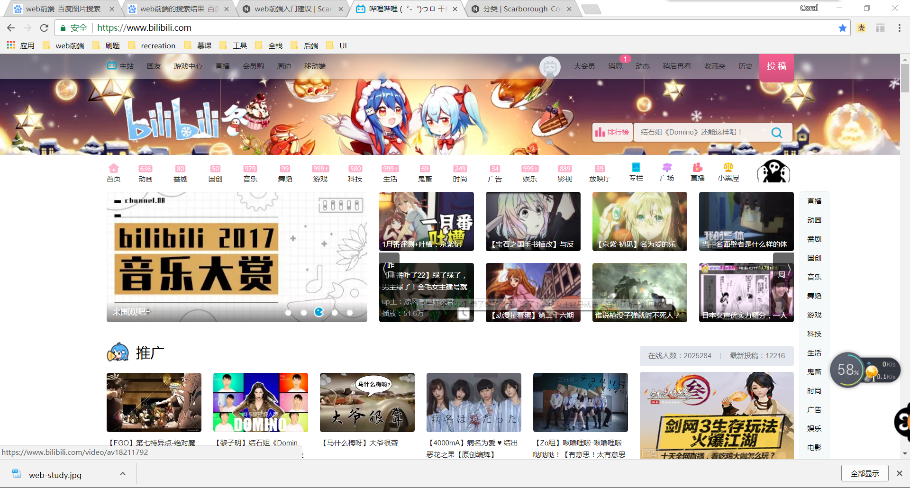
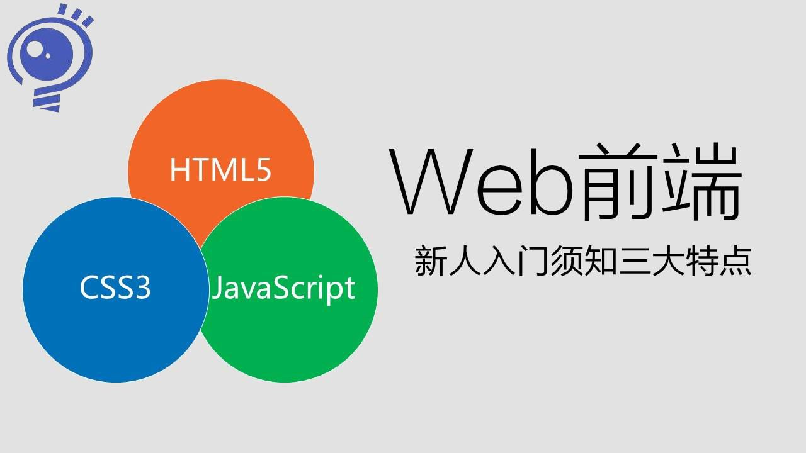
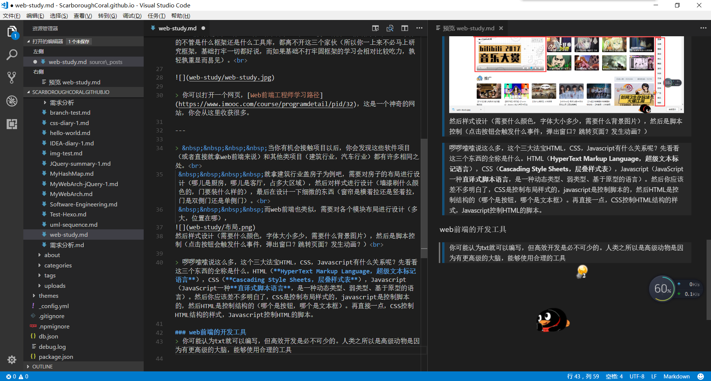
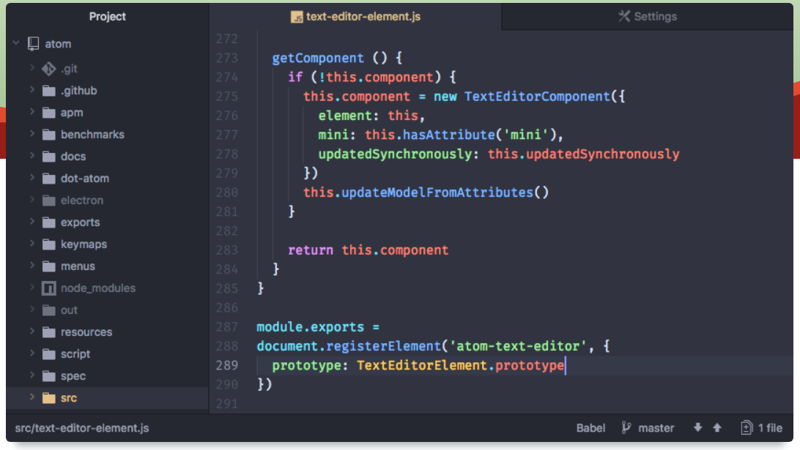


基础决定上层建筑。


<!-- more -->

### 欢迎
> 首先预祝学弟学妹们新年快乐！欢迎各位准备参与web前端的学习，没错，这篇文章适合于准备学习web前端但又不知道如何下手学习哪些知识的你们。

### web前端是什么

> 首先你要了解前端是什么，“所见即为前端”，前端就是给用户看的。当你打开一个手机app，打开一个浏览器进入一个网页，或者打开一个游戏，你看到的便是前端。当然这些前端归根结底都是同样的架构，不过是不同的实现方式而已。 

> web前端就是你打开浏览器进入一个网页所看到的，比如你现在正在看的这篇博客，比如你打开的bilibili，斗鱼直播等等 

> 可能你会混淆web前端和ui设计这两个概念。web前端工程师是根据ui设计师设计的原型来编写代码形成网页的，当然也有一些人同时做这两个工作。

### web前端需要学些什么
> web前端需要学些什么，看这张图就知道了，这便是咱们web前端的本命法宝，其他的不管是什么框架还是什么工具库，都离不开这三个家伙（所以你一上来不必马上研究框架，基础打牢一切都好说，而如果基础不打牢固框架的学习会相对比较吃力，孰轻孰重显而易见）。 

> 你可以打开一个网页，[Web前端工程师学习路径](https://www.imooc.com/course/programdetail/pid/32)，**这是一个神奇的网站，慕课网——程序员的梦工厂，你会从这里收获很多**。

---

> 当你真正接触项目以后，你会发现这些软件项目（或者直接就拿web前端来说）和其他类项目（建筑行业，汽车行业）都有许多相同之处。 
 就拿建筑行业盖房子为例吧，需要对房子的布局进行设计（哪儿是厨房，哪儿是客厅，占多大区域），然后对样式进行设计（墙漆刷什么颜色的，门要装什么样的），最后在设计一下细微的东西（窗帘是横着拉还是竖着拉，门是双侧门还是单侧门）。 
 而web前端也类似，需要对各个模块布局进行设计（多大，位置在哪），然后样式设计（需要什么颜色，字体大小多少，需要什么背景图片），然后是脚本控制（点击按钮会触发什么事件，弹出窗口？跳转页面？发生动画？） 

>  啰啰嗦嗦说这么多，这和大法宝HTML，CSS，Javascript有什么关系呢？先看看这三个东西的全称是什么。HTML（**HyperText Markup Language，超级文本标记语言**），CSS（**Cascading Style Sheets，层叠样式表**），Javascript（JavaScript一种**直译式脚本语言**，是一种动态类型、弱类型、基于原型的语言）。然后你应该差不多明白了，CSS是控制布局样式的，javascript是控制脚本的，然后HTML是控制结构的（哪个是按钮，哪个是文本框）。再直接一点，CSS是控制HTML结构的样式，Javascript是控制HTML的脚本。

### 讲一下我平时的开发流程
- 从美工那拿到原型图和切图（切图上标注的字体大小颜色等等）
- 根据切图进行界面代码的编写（包括布局样式事件等等）
- 对接接口（通过网络向后端请求资源，你先不必深入了解后端是干什么的，以后你就会慢慢清楚，你只需要知道你需要的数据时后端提供的。这里需要javascript控制ajax进行网络请求。）
- 测试修改

### web前端的开发工具
>  你可能认为txt就可以编写，但高效开发是必不可少的。人类之所以是高级动物是因为有更高级的大脑，能够使用合理的工具。在这里推荐几个编辑器：vs code（这是我现在在用的，开源的）、sublime text（虽然收费，但可破解，也很好用）、atom（有一些不可思议的插件，像打游戏一般敲代码combo）。**合理使用这几个编辑器里的插件会大大提高开发效率！！！**

- VS Code
[官网](https://code.visualstudio.com/)

- sublime text
[官网](https://www.sublimetext.com)

- atom
[官网](https://atom.io/)

### 寒假祝福语
>  祝各位学弟学妹新年快乐！假期是赶英超美鹤立鸡群青出于蓝胜于蓝长江后浪推前浪的好时机，假期少不了娱乐游玩，也少不了学习，希望各位能够在寒假放松的同时好好学习，过一个充实的寒假，让这个寒假在你的人生路上变得有意义。最后再说一句，**这个[网站](https://www.imooc.com/)对你很重要**。
