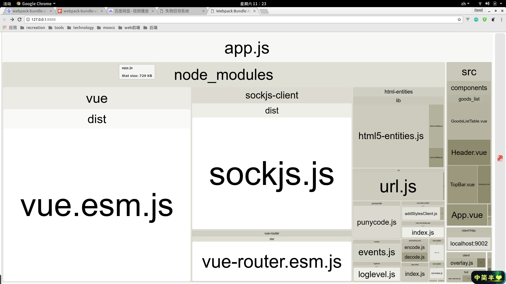
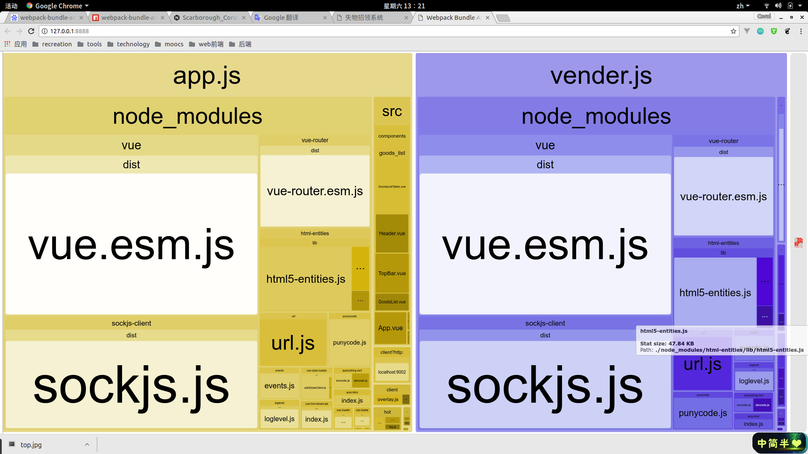
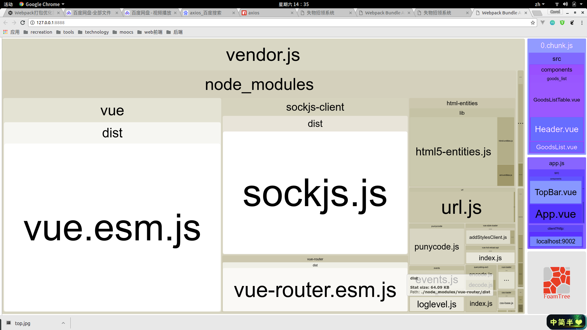
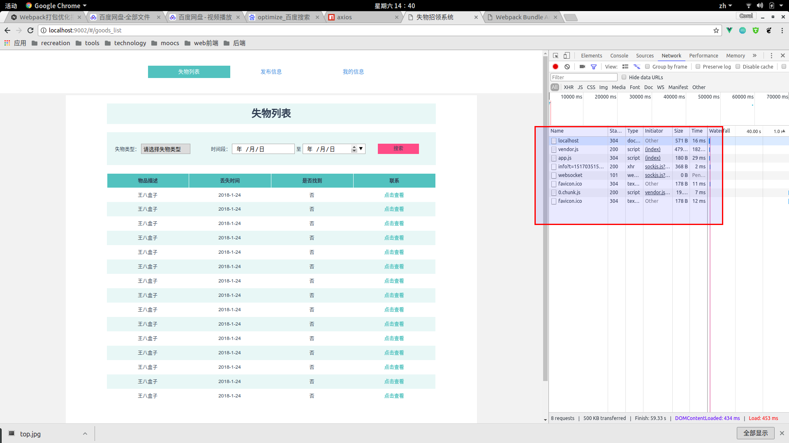
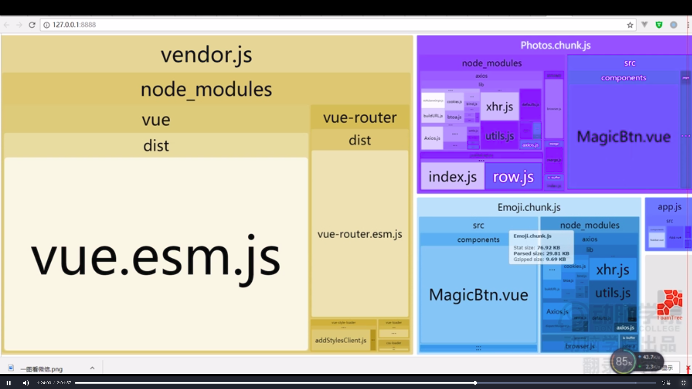
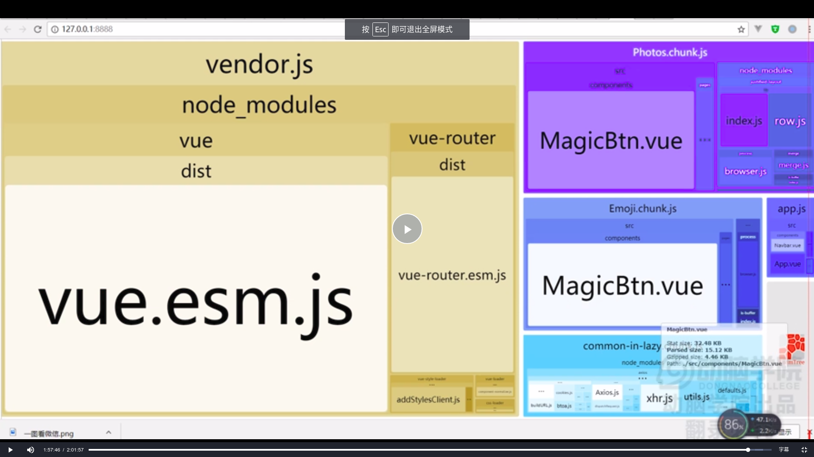


Stay hungry. Stay foolish.


<!-- more -->


### 前言

> web前端打包工具对于高效开发来说已是必不可少，但高效开发并不能保证用户体验好，我们经常为了减少http请求而将所有代码打包到一个js文件中，但这明显不科学。因为随着项目的扩展，js文件会越来越大，这会导致许多问题。这就需要我们来优化组织打包文件，对于webpack来说这也是很有必要的。

### 工具介绍
> 今天意外地发现了一个神奇的工具，是一个将webpack打包后的文件关系可视化的工具，叫**webpack-bundle-analyzer**，这里是npm的工具[链接](https://www.npmjs.com/package/webpack-bundle-analyzer),其效果如下。



### 优化第一步——第三方依赖分离

> 上图中很明显的看到只打包了一个js文件，app.js。它包含了第三方依赖代码和业务代码。每次http请求都会请求这个文件，而这个文件中常常有一些不变化的第三方依赖包。因为第三方依赖不想业务代码那样多变，所以我们就想能不能将业务代码和第三方依赖代码分离打包?然后第三方依赖缓存到客户端，这样就不必多次请求了。Bingo！我们只需要配置另一个入口文件，将第三方依赖配置上就OK了。

```javascript
module.exports = {
    ……
    entry:{
        app:"./src/main.js",
        vender:["vue","vue-router"]
    }
    ……
}
```

> 然后打包后的结果是这样的。



> 但是为毛打包的第三方依赖会重复？这不就相当于什么也没干而且还增加了负担？我们希望只有一份vue和vue-router然后让这两部分引用就行了。解决办法如下：

```javascript
// 在webpack配置中添加优化公共块插件
module.exports = {
    ……
    plugins:[
        new webpack.optimize.CommonsChunkPlugin({
            name:"vendor"
            })
    ]
    ……
}
```

> 这样就将公共的块抽取出来放到vendor中，结果如下：


> 这样第三方依赖就提取出来了，然后右边的业务代码单独分到一个打包文件中。

### 优化第二步——自动提取
> 我们会遇到这种情况，尽管已经使用了vue、vue-router这些依赖，但随着项目的增大，需求的扩展，我们需要另外一些第三方依赖，但每次都需要想入口文件中添加依赖。

```javascript
module.exports = {
    ……
    entry:{
        app:"./src/main.js",
        vender:["vue","vue-router","vuex","element-ui","很多很多很多很多"]
    }
    ……
}
```

> 有成千上万个第三方依赖，你难道需要一个个手打上去，这显然是傻。我们有没有什么方法让webpack大佬自动提取这些第三方依赖到打包文件中？方法是有的，我们需要配置一个脚本，代码如下：

```JavaScript
module.exports = {
    ……
    plugins:[
        new webpack.optimize.CommonsChunkPlugin({
            name:"vendor",
            minChunk:({resource})=>(
                resource&&
                resource.indexOf("node_modules")&&
                resource.match(/\.js$/)
            )
        })
    ]
    ……
}
```
> 这段代码即判断打包模块是否是第三方依赖的js，若是则放到vendor里。效果同上：


### 优化第三步——业务代码打包优化

> 可能你认为打包后的文件中第三方依赖大小比重占得多，所以业务代码打包不必优化。但这是错的，事实上恰恰相反，业务代码比重一般是最大的，所以需要对其进行分离组织优化。将一些模块懒加载，一些必要的首先加载,公共的代码需要提取。

#### 如何懒加载

> 首先先谈一下为什么要懒加载。比如你有许多模块，首先展示的是主页，然后同路由下有其他模块，这些模块的脚本就需要懒加载，让主页代码优先加载。那么如何懒加载呢？这一点我也很好奇，使用了以下代码。

```JavaScript
const LazyModule = ()=> import("The Module");

//比如说我在这儿有个路由下的失物列表需要懒加载，就需要这样

const GoodsList=()=> import('@/components/GoodsList.vue')

```

> 打包结果如下：



> 就将需要懒加载的模块单独打包了，**0.chunk.js**

> 懒加载前后页面资源变化
- 主页

- 其他路由页


#### 重复依赖提取

> 有时候我们会发现不同的页面用了相同第三方依赖，比如说**axios**（类似jQuery中的Ajax），我们需要将这些公共的依赖提取出来，这就需要再一次请教webpack大佬了。

```JavaScript
// 注意，这里的name必须和上面入口文件相同，以便提取
new webpack.optimize.CommonsChunkPlugin({
    name:"app",
    async:"common-in-lazy",
    minChunks:({resource})=>(
    resource&&
    resource.indexOf("node_modules")>-1&&
    /axious/.test(resource)
    )
})
```

> 这样，公共的依赖代码就提取出来了，效果如下：



> 再一次感受到了webpack的强大之处，然后这个webpack-bundle-analyzer这个工具的有趣与强大。


### Thanks！